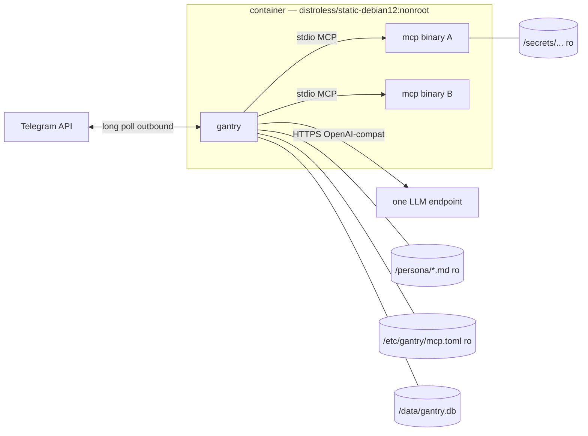
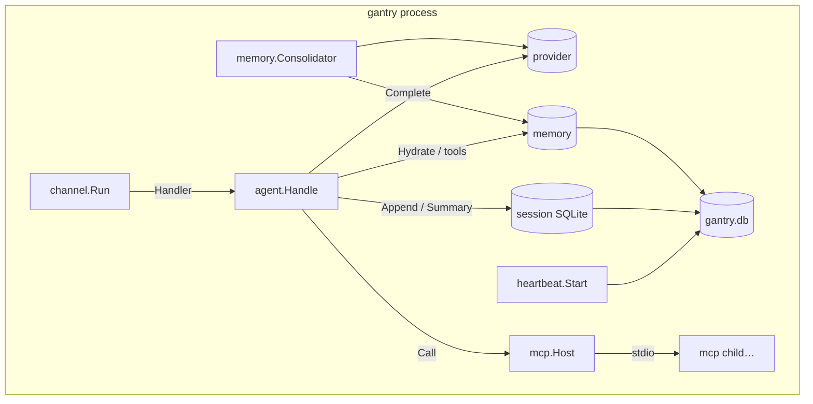
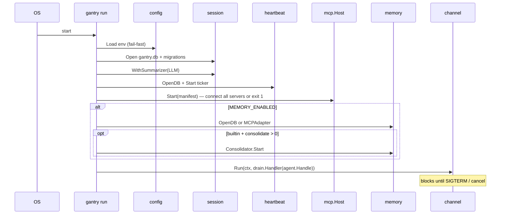
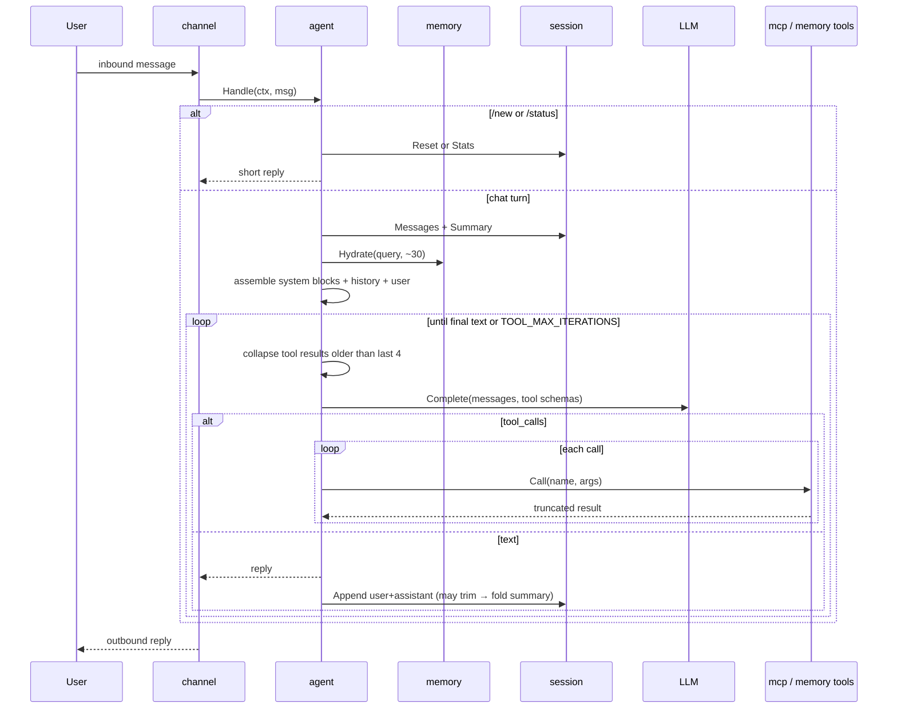
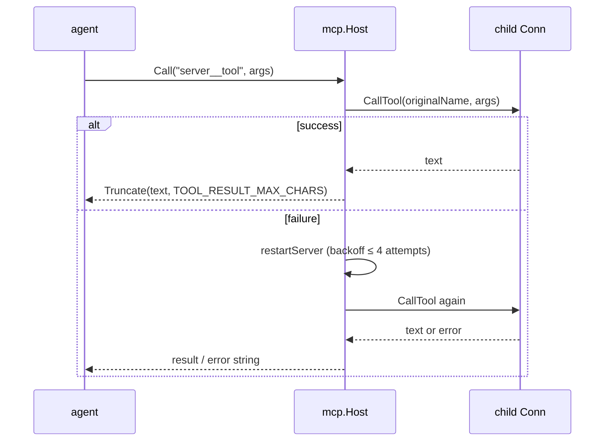
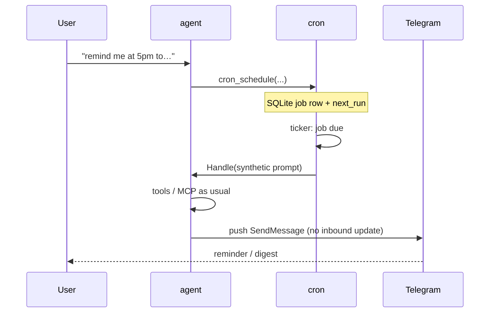
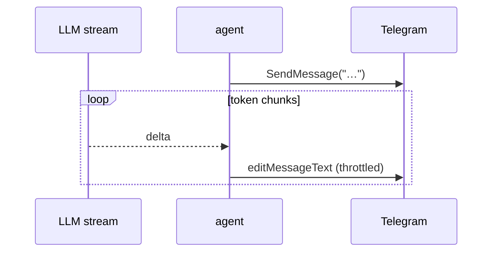

# Architecture

ai-gantry is a single static Go binary that hosts one persona, one LLM
endpoint, and a set of MCP tool processes. Scaling is horizontal: one
container per brain.

## Container view



Nothing listens inbound. Health is `gantry status` (exit code) reading a
heartbeat row in SQLite — Docker exec form, no shell.

## Package layout

```text
cmd/gantry/          run | status | version
cmd/release/         semver bump → tag → push (dev tooling)
internal/config/     env parse + fail-fast validation
internal/channel/    Channel interface; telegram/, stdio/
internal/provider/   OpenAI-compatible Completer (one implementation)
internal/mcp/        manifest, spawn, list/call tools, truncate, restart
internal/agent/      prompt assembly, tool loop, collapse, reply
internal/session/    bounded history + rolling summary
internal/memory/     Memory interface, builtin SQLite/FTS5, MCP adapter, consolidator
internal/persona/    load + concat /persona/*.md
internal/heartbeat/  singleton row for Docker healthcheck
internal/drain/      in-flight turn wait on SIGTERM
```

## Process model (goroutines)

One OS process. Concurrent work:

| Goroutine | Job |
| --- | --- |
| channel poller | Telegram `getUpdates` (or stdio REPL); allowlist filter |
| agent handler | per message: assemble → model → tools → reply (Telegram: workers=1) |
| MCP children | one OS process per manifest server (stdio), supervised by host |
| heartbeat ticker | upsert `heartbeat` every ~15s |
| memory consolidator | optional timer (`MEMORY_CONSOLIDATE_MINUTES`; `0` = off) |



## Boot sequence



## Message / agent loop



## MCP tool call (with restart)



Children are **not** bound to the signal context. On SIGTERM the channel
stops accepting work, `drain.Gate` waits for the in-flight turn (default 2m),
then deferred `mcp.Host.Close()` tears down stdio sessions (killing children).

## Data on disk

One WAL SQLite file: `$DATA_DIR/gantry.db`.

| Table | Owner package | Purpose |
| --- | --- | --- |
| `session` / `session_message` | `session` | history + rolling `summary` |
| `memory` / `memory_fts` | `memory` | structured long-term memory |
| `heartbeat` | `heartbeat` | singleton row for `gantry status` |

`/new` deletes the session row (cascade messages + summary). Memory rows are
untouched.

## Prompt assembly (order)

1. System: persona markdown (+ memory persona-precedence note when memory on)
2. System: `[memory]` hydration block (optional, ≤ ~30 rows)
3. System: `[session summary]` (optional)
4. History: user/assistant turns (bounded)
5. User: current message

Tool schemas are attached on the completion request, not as chat messages.

## External dependencies (import over write)

| Concern | Library |
| --- | --- |
| MCP client | `modelcontextprotocol/go-sdk` |
| SQLite | `modernc.org/sqlite` |
| Telegram | `go-telegram/bot` |
| LLM | `openai/openai-go/v3` (custom base URL) |
| Env | `caarlos0/env/v11` |
| Manifest | `pelletier/go-toml/v2` |
| Logs | stdlib `log/slog` → **stderr** |

See [choices.md](choices.md) for why each pick stuck.

## Cron push (Milestone 6)



Outbound push needs a channel API beyond “reply to the update that invoked
Handle” — Telegram chat/user id is stored with the job from the scheduling turn.

## Planned: streaming (Milestone 7)



Tool-call iterations can stay buffered; streaming targets the final assistant
text path first.
