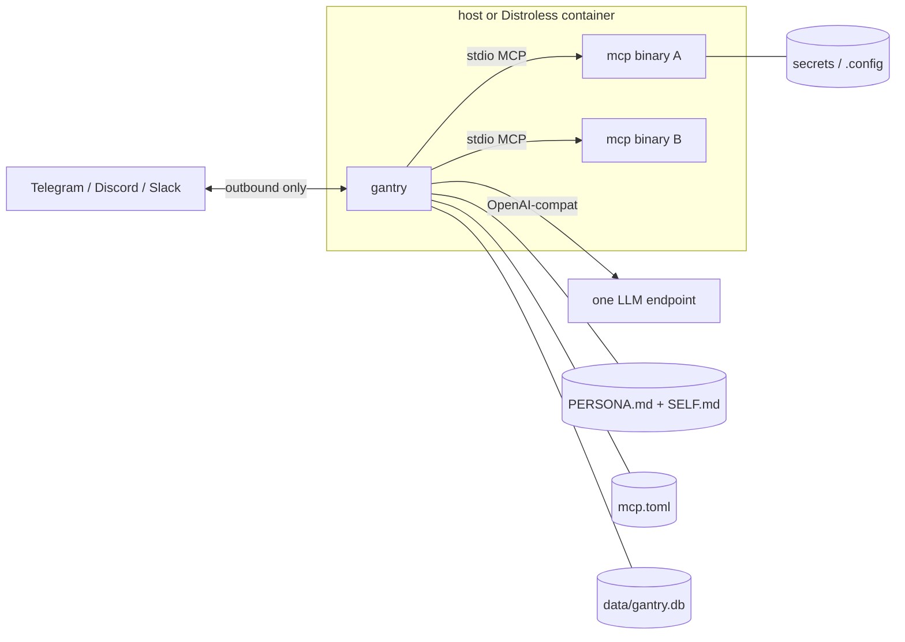
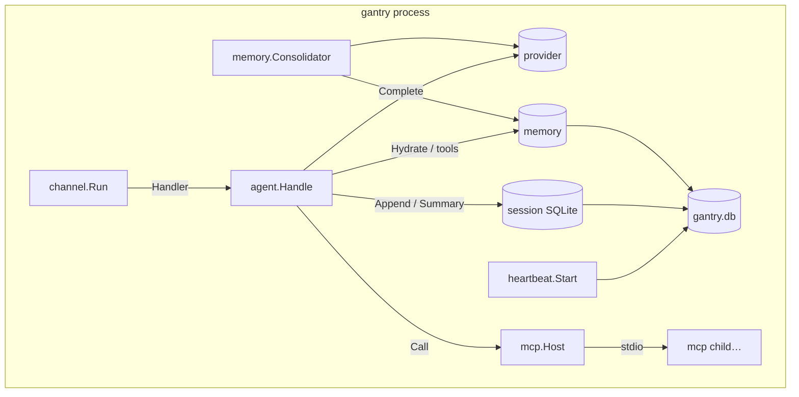
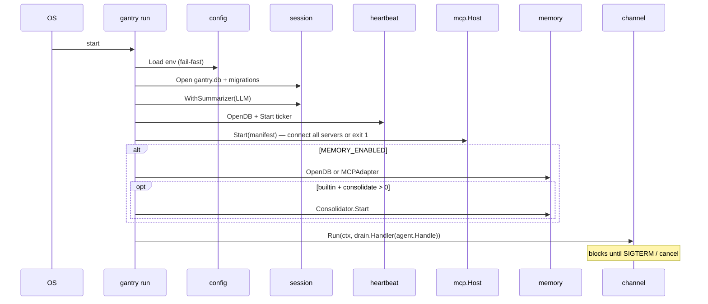
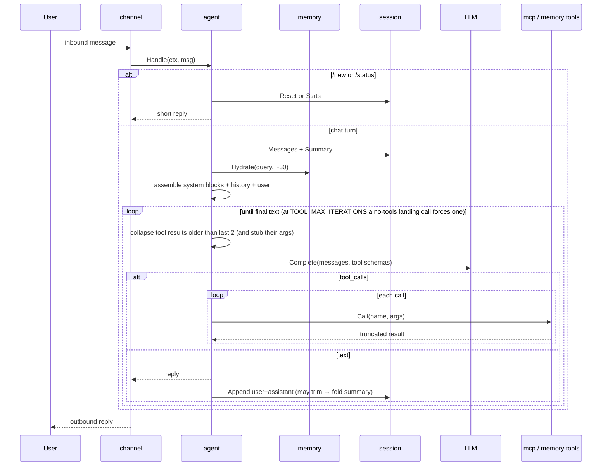
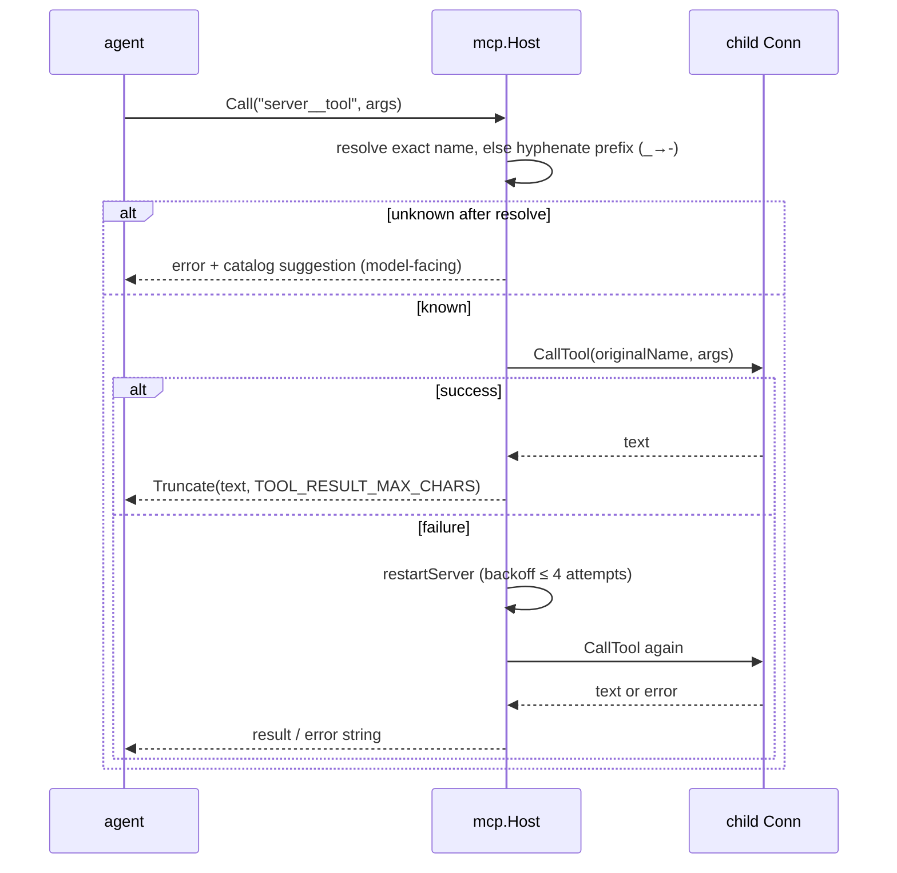
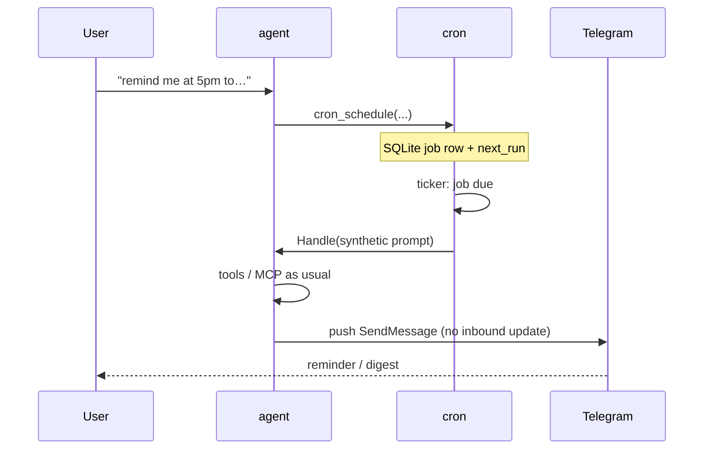
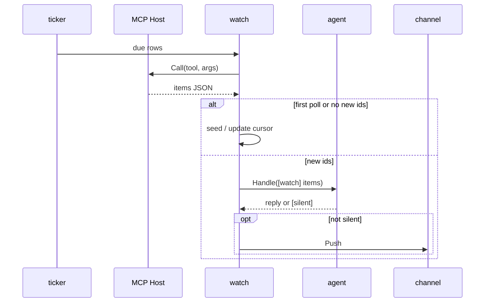

# Architecture

ai-gantry is a single static Go binary — an **AI harness** that hosts one
persona, one LLM endpoint, and a set of MCP tool processes so the agent can
**plan on a long horizon**. Scaling is horizontal: one container (or systemd
unit) per brain. Harness contract (env, loop, memory):
[design.md](design.md). Hello path: [root readme](../readme.md).

## Container view


```mermaid
flowchart LR
  CH[Telegram / Discord / Slack] <-->|outbound only| K

  subgraph Host["host or Distroless container"]
    K[gantry]
    M1[mcp binary A]
    M2[mcp binary B]
    K -->|stdio MCP| M1
    K -->|stdio MCP| M2
  end

  K -->|OpenAI-compat| LLM[one LLM endpoint]
  K --- P[("PERSONA.md + SELF.md")]
  K --- MF[("mcp.toml")]
  K --- D[("data/gantry.db")]
  M1 --- S[("secrets / .config")]
```

Nothing listens inbound. Health is `gantry status` (exit code) reading a
heartbeat row in SQLite — Docker exec form, no shell. Persona is writable when
self-notes are on (`SELF.md`); `:ro` disables that feature.

Deploy shapes: [deploy-native.md](deploy-native.md) ·
[deploy-docker.md](deploy-docker.md).

## Package layout

```text
cmd/gantry/          run | init | auth | status | version
cmd/release/         semver bump → tag → push (dev tooling)
internal/config/     env parse + fail-fast validation
internal/channel/    Channel interface; telegram/, discord/, slack/, stdio/
internal/provider/   OpenAI-compatible Completer (one implementation)
internal/mcp/        manifest, spawn, list/call tools, truncate, restart
internal/mcpenable/  dynamic tool prefix grants
internal/agent/      prompt assembly, tool loop, collapse, reply
internal/session/    bounded history + rolling summary
internal/memory/     Memory interface, builtin SQLite/FTS5, MCP adapter, consolidator
internal/persona/    load PERSONA.md + SELF.md
internal/selfnote/   SELF.md tool + distill on /new
internal/heartbeat/  singleton row for Docker healthcheck
internal/drain/      in-flight turn wait on SIGTERM
internal/cron/       scheduled turns → agent → channel push
internal/watch/      poll MCP fetch tools; wake only on new item ids
internal/examples/   /examples capability pings
internal/logfwd/     optional slog → chat
```

One provider implementation is deliberate: Gemini, ChatGPT, and local models all
speak OpenAI-compat. Model identity is `LLM_BASE_URL` + `LLM_MODEL` +
`LLM_API_KEY`.

## Process model (goroutines)

One OS process. Concurrent work:

| Goroutine | Job |
| --- | --- |
| channel poller | Telegram `getUpdates` / Discord Gateway / Slack Socket Mode / stdio; allowlist filter |
| agent handler | per message: assemble → model → tools → reply; follow-ups settle then steer the live turn (Telegram: workers=2 so `/cancel` + barge-in can run) |
| MCP children | one OS process per manifest server (stdio), supervised by host |
| heartbeat ticker | upsert `heartbeat` every ~15s |
| memory consolidator | optional timer (`MEMORY_CONSOLIDATE_MINUTES`; `0` = off) |
| cron + watch tickers | clock jobs → agent → push; fetch-tool polls → wake only on new ids |


```mermaid
flowchart TB
  subgraph gantry["gantry process"]
    CH[channel.Run]
    AG[agent.Handle]
    MCP[mcp.Host]
    HB[heartbeat.Start]
    CON[memory.Consolidator]
    CH -->|Handler| AG
    AG -->|Complete| LLM[(provider)]
    AG -->|Call| MCP
    AG -->|Append / Summary| SES[(session SQLite)]
    AG -->|Hydrate / tools| MEM[(memory)]
    HB --> DB[(gantry.db)]
    SES --> DB
    MEM --> DB
    CON --> MEM
    CON --> LLM
    MCP -->|stdio| C1[mcp child…]
  end
```

## Boot sequence


```mermaid
sequenceDiagram
  participant OS
  participant Run as gantry run
  participant Cfg as config
  participant Ses as session
  participant HB as heartbeat
  participant MCP as mcp.Host
  participant Mem as memory
  participant Ch as channel

  OS->>Run: start
  Run->>Cfg: Load env (fail-fast)
  Run->>Ses: Open gantry.db + migrations
  Run->>Ses: WithSummarizer(LLM)
  Run->>HB: OpenDB + Start ticker
  Run->>MCP: Start(manifest) — connect all servers or exit 1
  alt MEMORY_ENABLED
    Run->>Mem: OpenDB or MCPAdapter
    opt builtin + consolidate > 0
      Run->>Mem: Consolidator.Start
    end
  end
  Run->>Ch: Run(ctx, drain.Handler(agent.Handle))
  Note over Ch: blocks until SIGTERM / cancel
```

## Message / agent loop

One turn is execution. Long-horizon planning is those turns chained across
memory, cron, watches, and `SELF.md` — same loop, later.


```mermaid
sequenceDiagram
  participant U as User
  participant Ch as channel
  participant A as agent
  participant M as memory
  participant S as session
  participant L as LLM
  participant T as mcp / memory tools

  U->>Ch: inbound message
  Ch->>A: Handle(ctx, msg)
  alt /new or /status
    A->>S: Reset or Stats
    A-->>Ch: short reply
  else chat turn
    A->>S: Messages + Summary
    A->>M: Hydrate(query, ~30)
    A->>A: assemble system blocks + history + user
    loop until final text (at TOOL_MAX_ITERATIONS a no-tools landing call forces one)
      A->>A: collapse tool results older than last 2 (and stub their args)
      A->>L: Complete(messages, tool schemas)
      alt tool_calls
        loop each call
          A->>T: Call(name, args)
          T-->>A: truncated result
        end
      else text
        A-->>Ch: reply
        A->>S: Append user+assistant (may trim → fold summary)
      end
    end
  end
  Ch-->>U: outbound reply
```

## MCP tool call (resolve → call → restart)


```mermaid
sequenceDiagram
  participant A as agent
  participant H as mcp.Host
  participant C as child Conn

  A->>H: Call("server__tool", args)
  H->>H: resolve exact name, else hyphenate prefix (_→-)
  alt unknown after resolve
    H-->>A: error + catalog suggestion (model-facing)
  else known
    H->>C: CallTool(originalName, args)
    alt success
      C-->>H: text
      H-->>A: Truncate(text, TOOL_RESULT_MAX_CHARS)
    else failure
      H->>H: restartServer (backoff ≤ 4 attempts)
      H->>C: CallTool again
      C-->>H: text or error
      H-->>A: result / error string
    end
  end
```

Children are **not** bound to the signal context. On SIGTERM the channel
stops accepting work, `drain.Gate` waits for the in-flight turn (default 2m),
then deferred `mcp.Host.Close()` tears down stdio sessions (killing children).

Operator details (naming, local REPL, why alias exists): [mcp.md](mcp.md).

## Data on disk

One WAL SQLite file: `$DATA_DIR/gantry.db`.

| Table | Owner package | Purpose |
| --- | --- | --- |
| `session` / `session_message` | `session` | history + rolling `summary` |
| `memory` / `memory_fts` | `memory` | structured long-term memory |
| `heartbeat` | `heartbeat` | singleton row for `gantry status` |
| cron / watch job rows | `cron` / `watch` | scheduled turns and fetch-tool cursors — [cron.md](cron.md) · [watch.md](watch.md) |

`SELF.md` lives in `PERSONA_DIR`, not SQLite. `/new` deletes the session row
(cascade messages + summary) after `Voice:` merges into `SELF.md` and
`Facts:` park as a memory episode. Memory rows are untouched.

## Prompt assembly (order)

1. System: `PERSONA.md` then `SELF.md` (+ memory persona-precedence note when memory on)
2. System: `[memory]` hydration block (optional, ≤ ~30 rows)
3. System: `[session summary]` (optional)
4. History: user/assistant turns (bounded)
5. User: current message

Tool schemas are attached on the completion request, not as chat messages.

## External dependencies (import over write)

| Concern | Library | Why |
| --- | --- | --- |
| MCP client | `github.com/modelcontextprotocol/go-sdk` | Official SDK; stdio transport, schema handling |
| SQLite | `modernc.org/sqlite` | Pure Go (no CGO), FTS5 works, one file DB |
| Telegram | `github.com/go-telegram/bot` | Zero-dep, maintained, long-poll native |
| LLM client | `github.com/openai/openai-go/v3` | Official; custom `base_url` covers Gemini, xAI, Ollama |
| Env config | `github.com/caarlos0/env/v11` | Struct tags → env, tiny |
| MCP manifest | `github.com/pelletier/go-toml/v2` | Minimal TOML for `mcp.toml` |
| Logging | stdlib `log/slog` | JSON to **stderr** (stdio REPL stays clean) |

See [choices.md](choices.md) for why each pick stuck.

## Cron push (Milestone 6)


```mermaid
sequenceDiagram
  participant U as User
  participant A as agent
  participant C as cron
  participant T as Telegram

  U->>A: "remind me at 5pm to…"
  A->>C: cron_schedule(...)
  Note over C: SQLite job row + next_run
  C->>C: ticker: job due
  C->>A: Handle(synthetic prompt)
  A->>A: tools / MCP as usual
  A->>T: push SendMessage (no inbound update)
  T-->>U: reminder / digest
```

Outbound push needs a channel API beyond “reply to the update that invoked
Handle” — Telegram chat/user id is stored with the job from the scheduling turn.

## Event watches

Poller is code, not the agent. Quiet ticks never call the Completer.


```mermaid
sequenceDiagram
  participant T as ticker
  participant H as MCP Host
  participant W as watch
  participant A as agent
  participant C as channel

  T->>W: due rows
  W->>H: Call(tool, args)
  H-->>W: items JSON
  alt first poll or no new ids
    W->>W: seed / update cursor
  else new ids
    W->>A: Handle([watch] items)
    A-->>W: reply or [silent]
    opt not silent
      W->>C: Push
    end
  end
```

Details: [watch.md](watch.md).

## Streaming replies (Milestone 7)

Default on: `STREAM_REPLIES=true`. Channel attaches a `ReplyWriter`; agent uses
`provider.CompleteStream` when available.

```mermaid
sequenceDiagram
  participant L as LLM stream
  participant A as agent
  participant T as Telegram

  A->>T: SendMessage("…")
  loop token chunks
    L-->>A: delta
    A->>T: editMessageText (throttled)
  end
  A->>T: Finish (final text; overflow as extra messages)
```

Tool-call chunks skip live text updates; cron push stays buffered.

