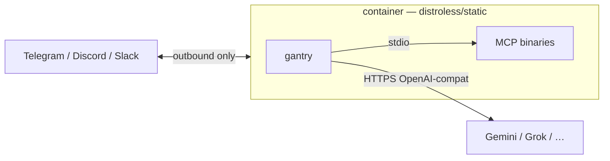

# Deploy: Docker (Hub / compose)

Run gantry as a **distroless container**: outbound chat only, mounts for
persona + `mcp.toml` + data. Fastest path when you want a cloud
OpenAI-compatible LLM (Gemini is the cookbook default) without installing a
local model host.

**Published images** (CI on every `main` push and `v*` tag):

| Registry | Image |
| --- | --- |
| [Docker Hub](https://hub.docker.com/r/shotah/ai-gantry) | `shotah/ai-gantry:latest` / `:edge` / `:0.x.y` |
| GHCR | `ghcr.io/shotah/ai-gantry:…` (same tags) |

`:latest` = latest release tag · `:edge` = `main` · pin `:0.x.y` for production.

Kernel contract (env, mounts, MCP): [root readme](../readme.md). Why Hub is the
stranger path: [positioning.md](positioning.md). Tool naming: [mcp.md](mcp.md).
Full life-stack appliance: [local-agent/](../local-agent/).



---

## Hello in five minutes (pull from Hub, no tools)

**Telegram + Gemini.** You need: Docker, a
[Gemini API key](https://aistudio.google.com/apikey), a bot token from
[@BotFather](https://t.me/BotFather), and your numeric user id (e.g.
[@userinfobot](https://t.me/userinfobot)).

```bash
docker pull shotah/ai-gantry:latest
docker run --rm shotah/ai-gantry:latest version

git clone https://github.com/shotah/ai-gantry.git && cd ai-gantry
# Consumer template (copy examples/docker to a new repo, or seed in-tree):
make example-docker
cd examples/docker
# set GEMINI_API_KEY, TELEGRAM_BOT_TOKEN, TELEGRAM_ALLOWED_USERS in .env
make up
make logs
```

Message the bot → `/status` → `/new`. Memory and cron work immediately; MCP
servers stay commented until tools are granted.

Always-on VM templates: **[examples/hosting/](../examples/hosting/)**
([GCP GCE](../examples/hosting/gcp/) · [AWS EC2](../examples/hosting/aws/)).

### Discord / Slack (same compose)

Swap the channel in `.env` after [discord.md](discord.md) or [slack.md](slack.md):

```bash
CHANNEL=discord
DISCORD_BOT_TOKEN=...
DISCORD_ALLOWED_USERS=123456789012345678
```

Then `make up` from the consumer tree.

---

## Compose contract

```yaml
services:
  gantry:
    image: shotah/ai-gantry:latest   # or :edge / :0.x.y
    env_file: .env
    volumes:
      # Persona writable for SELF.md (self_note + /new distill). Use :ro only with SELF_NOTES_ENABLED=false.
      - ./deploy/persona:/persona
      - ./deploy/mcp.toml:/etc/gantry/mcp.toml:ro
      - ./deploy/data:/data        # gantry.db (sessions + memory)
      - ./deploy/secrets:/secrets:ro
    healthcheck:
      # exec form + full path — distroless has no shell
      test: ["CMD", "/usr/local/bin/gantry", "status"]
```

Second persona / LLM = second service block. Nothing inbound; health is
`gantry status` (exit code).

---

## Appliance path (Docker)

For Workspace / Strava / Garmin / Cast / search baked into one image:

```bash
cd local-agent && make init && make up
# remote Ubuntu: make remote-deploy  →  docs/deploy.md
```

See [local-agent/README.md](../local-agent/README.md) and
[local-agent/docs/deploy.md](../local-agent/docs/deploy.md).

---

## MCP tool auth (browser OAuth)

Chat works with **zero** MCP servers. When you grant tools that need a browser
login (Google Workspace, Strava, …), authorize **once on the machine that has
your browser** — usually the laptop running Docker Desktop — then copy tokens
to the server if the agent runs elsewhere.

```bash
cd local-agent
make build                 # once: image includes MCP tools (tools-fetch)
make google-auth           # browser → http://localhost:4100/…
make ghealth-auth          # browser → http://127.0.0.1:4101/…
make strava-auth           # browser → http://localhost:19876/…
# also: make garmin-auth | youtube-auth | …
```

What to expect:

1. A URL prints in the terminal (the container cannot open your browser).
2. Open it, approve access.
3. The provider redirects to `http://localhost:<port>/…` on **this** machine;
   Compose publishes that port into the auth container.
4. Tokens land under `data/.config/…`. If `DEPLOY_HOST` is set, Make pushes
   them to the server automatically.

| Tool | Make target | Redirect (OAuth client) |
| --- | --- | --- |
| Google Workspace | `make google-auth` | `http://localhost:4100/oauth2callback` |
| Google Health | `make ghealth-auth` | `http://127.0.0.1:4101/oauth2callback` |
| Strava | `make strava-auth` | callback domain `localhost` (port 19876) |
| YouTube | `make youtube-auth` | device flow (no localhost callback) |
| Garmin | `make garmin-auth` or `/auth garmin` | TTY login, or chat MFA with `GARMIN_EMAIL`/`PASSWORD` |

**Do not** run Google/Strava auth over SSH on a headless box — the browser
callback is `localhost` on *your* PC. Auth locally, then sync secrets (or use
the Make targets above with `DEPLOY_HOST` set).

**Remote / headless alternative:** chat `/auth <server>` (PKCE paste or device
flow) — see **[auth.md](auth.md)**. No inbound ports; tokens land on the box
running gantry.

Per-tool setup: [google-workspace](../local-agent/docs/google-workspace.md) ·
[google-health](../local-agent/docs/google-health.md) ·
[strava](../local-agent/docs/strava.md) · [youtube](../local-agent/docs/youtube.md) ·
[garmin](../local-agent/docs/garmin.md).

---

## When to prefer Docker

| Prefer Docker / Hub when… | Prefer [native](deploy-native.md) when… |
| --- | --- |
| You want `docker pull` + compose in minutes | You want Ollama/Qwen on metal (no container tax) |
| Cloud LLM (Gemini/Grok) is fine | Local model + systemd on a mini-PC |
| Distroless sandbox is the grant story | Host PATH + `/opt/gantry` tree is enough |

Model swap is always `LLM_BASE_URL` + `LLM_API_KEY` + `LLM_MODEL` — same
binary in either supervisor.
