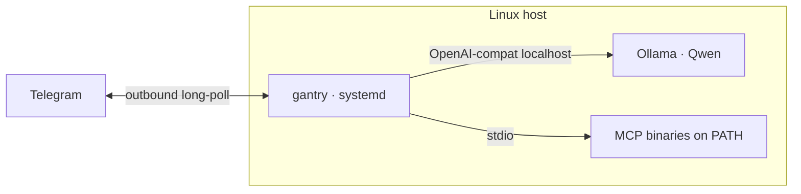

# Deploy: Native (Linux + systemd + local model)

Run the same static **AI harness** (`gantry`) on the host under systemd —
typically next to [Ollama](https://ollama.com) and a local chat model (we use
**Qwen** in production). No Docker on the agent box; MCP tools are plain
binaries on `PATH`. Same long-horizon contract as Docker: memory, cron,
watches, `SELF.md`.

Harness contract: [design.md](design.md). Hello path:
[root readme](../readme.md). Tool naming: [mcp.md](mcp.md).
Consumer template (unit + `install.sh`): [examples/native/](../examples/native/).



---

## Why native + local models

| Goal | Native path |
| --- | --- |
| Own the weights | Ollama (or any OpenAI-compat) on the same box |
| Skip container tax | One process, journald logs, host networking for Cast/mDNS |
| Same harness contract | Identical env + persona + `mcp.toml` as Docker |

Cloud LLMs still work (`LLM_*` → Gemini/ChatGPT). Native shines when the brain
is local and you care about RAM, keep-alive, and tool-call quality.

---

## Featured stack (`examples/native`)

Local-model shape this harness is built for:

| Piece | Choice |
| --- | --- |
| Chat | Ollama · `qwen3.6:35b-a3b` (or current pin) |
| Channel | Telegram allowlist |
| Supervisor | systemd unit under `/opt/gantry` |
| Tools | Optional MCP via `mcp.toml` + `gantry tools-fetch` |

On the host:

```bash
make example-native
cd examples/native
# gantry.env: Telegram + LLM_* (Ollama defaults in gantry.env.example)
sudo ./install.sh
```

Layout and day-to-day: **[examples/native/README.md](../examples/native/README.md)**.
A full life-stack (persona + MCP + compose) lives in a consumer repo, not this harness.

Minimal `LLM_*` for Ollama on the same machine:

```env
LLM_BASE_URL=http://127.0.0.1:11434/v1
LLM_API_KEY=ollama
LLM_MODEL=qwen3.6:35b-a3b
```

---

## How gantry tackles local-model rough edges

Small / thinking models (Qwen) are great offline brains but messy with tools.
The harness hardens the loop so SAM finishes multi-step turns:

| Failure mode | What gantry does |
| --- | --- |
| Fat MCP catalogs drown Flash/Qwen | Manifest `tools` / `exclude` + MCP `--tool-tier` (e.g. Garmin `core`) |
| Hyphenated prefix mangled to underscores (`google_search__…`) | Host aliases prefix `_`→`-` when the catalog matches ([mcp.md](mcp.md)) |
| Invented tool names (`…__web_search`) | Model-facing catalog suggestions on unknown tools |
| Answer stuck in CoT after a successful tool | Promote thinking → user reply (no ERROR stall) |
| Prompt cache thrash | Stable message prefix (persona / summary / history); volatile blocks last |
| Schema token blowups | `TOOL_SCHEMA_MAX_TOKENS` + boot `est_tokens` logging |

The live catalog spells exact names (`/tools` + schemas). Runtime fixes catch the rest.

---

## Latency: measure before tuning

On a local model, "slow" is almost never decode speed. Decode is steady; the
wait is **prefill** (persona + tool schemas + history re-evaluated) and
**thinking tokens spent before the first tool call**. Both are visible in the
journal — `gantry` logs every turn:

```bash
journalctl -u gantry -f | grep -E 'model call|tool done|turn perf'
```

| Log line | Fields | Read it as |
| --- | --- | --- |
| `model call` | `first_token_ms`, `dur_ms`, `volatile_est_tokens`, `prompt_est_tokens`, `schema_est_tokens`, native `prompt_tokens` when sent | `first_token_ms` ≈ prefill; the rest of `dur_ms` is decode |
| `tool done` | `dur_ms`, `result_chars` | Slow MCP vs slow model; `result_chars` lands in the volatile tail |
| `turn perf` | `source`, `user_id`, `session_id`, `iterations`, `tool_calls`, `max_batch`, `recoveries`, `prompt_est_tokens`, `gen_est_tokens`, `prompt_tokens`, `completion_tokens`, `total_tokens`, `model`, `finish_reason`, `model_ms`, `tool_ms`, `total_ms`, `outcome` | Trajectory: work per Completer round |

**`volatile_est_tokens` is the number that predicts `first_token_ms`, not
`prompt_est_tokens`.** The prefix (persona + summary + history) is byte-stable
across turns and gets cached; only the tail — hydration, clock, user message,
and tool results from earlier iterations — is re-evaluated. A warm turn with a
big total prompt is fine; a warm turn with a big *volatile* tail is not.

Cross-check the model side against Ollama's own numbers (`prompt eval count`
and `eval count` with per-token timings):

```bash
journalctl -u ollama -f
```

### Levers, cheapest first

| Lever | Where | Effect |
| --- | --- | --- |
| Stable prompt prefix | code — persona/summary/history first, volatile last; `Host.Tools()` sorted | Biggest single win measured on Qwen/890M: a reshuffled tool block broke the prompt cache and cost ~68s of re-prefill per turn instead of ~2s |
| `OLLAMA_CONTEXT_LENGTH` | Ollama unit / drop-in env | Ollama's default `num_ctx` is small; overflowing it forces context shifting + re-prefill every turn |
| `OLLAMA_KEEP_ALIVE=-1` | same | Model stays resident; confirm with `ollama ps` (want `100% GPU`) |
| `LLM_REASONING_EFFORT=none` | `gantry.env` | Native default. Thinking tokens decode at full price *before* any tool fires |
| `TOOL_RESULT_MAX_CHARS` | `gantry.env` | Native default `6000`. Results are re-sent each loop iteration, so this multiplies prefill |
| Shorter replies | persona (`PERSONA.md` → Communication) | Decode is a hard ~23 tok/s: a 230-token reply *is* 10s. Halving reply length halves that. Persona text is in the cached prefix, so it costs nothing per turn |
| Fewer tools | `mcp.toml` `tools` / `exclude`, MCP `--tool-tier` | Schemas are cached once the prefix is stable, but they inflate total context — and prefill rate falls with length (~1000 tok/s at 16k vs ~264 tok/s at 25k) |
| `COALESCE_SETTLE_MS` | `gantry.env` | Quiet window before a follow-up steers the live turn — lone messages do not wait |
| `SPINUP_NOTICE_MS` | `gantry.env` | Doesn't make a turn faster — opens the bubble during silent prefill so it stops *feeling* frozen |
| `OLLAMA_FLASH_ATTENTION` / `OLLAMA_KV_CACHE_TYPE=q8_0` | Ollama unit / drop-in (commented until measured) | Faster prefill, much smaller KV cache; measure quality before keeping |
| Smaller / router model | `LLM_MODEL`, or a second endpoint | Real work — only worth it once the logs say model time dominates |

Restarting Ollama after a context / keep-alive change makes the next turn
cold. Leave the unit alone on ordinary gantry redeploys so the model stays
resident.

### Perceived latency

Tool chains stream a trace into the Telegram bubble (`→ garmin__activities_list`
then `✓ 1.2s · 4.1k chars`), so a long turn shows motion instead of looking
frozen. With `LLM_REASONING_EFFORT=none` that trace is the whole expandable
block. Needs `STREAM_REPLIES=true`.

Prefill itself is silent, so `SPINUP_NOTICE_MS` (default `4000`) opens the
bubble with a "hang on" line before the first token:

- **First turn after gantry starts** posts a random cold-start line immediately —
  that turn is known-cold (model load and/or an empty prompt cache) and measures
  ~76s against ~15s in steady state.
- **Later turns** post a random "still working" line only after the threshold,
  which covers a prompt-cache miss. Nothing in an OpenAI-compatible API reveals one:
  `ollama ps` reports the model resident (`expires_at` in the year 2318 under
  `OLLAMA_KEEP_ALIVE=-1`) whether the turn takes 15s or 76s, and the KV prefix
  cache has no API at all. Observed silence is the only honest signal.

Unlike a tool trace the notice is transient — the first token clears it and the
reply takes the bubble, so it never lingers in the finished message.

---

## REPL / hack loop (no systemd)

From the repo root, against any OpenAI-compat endpoint (including Ollama):

```bash
make init
# deploy/mcp.toml + .env — set LLM_* to Ollama or Gemini
make run    # CHANNEL=stdio
```

`/status` · `/tools` · ask for a dated tool call. See [mcp.md](mcp.md).

---

## When to prefer native

| Prefer native when… | Prefer [Docker](deploy-docker.md) when… |
| --- | --- |
| Ollama/Qwen (or other local) on a mini-PC | Hub image + compose is enough |
| Cast / LAN tools want host network simply | Distroless grant story matters most |
| You already live in systemd + journalctl | Workstation has Docker; server gets `remote-deploy` |

Same binary, same mounts-or-paths contract — only the supervisor changes.

---

## Host signals

No metrics port. RAM, GPU, and timing are already visible from the host.

**The memory trap:** Ollama loads weights into GPU VRAM. `top` shows a small
RSS for `ollama`. Ask Ollama and the GPU:

```bash
ollama ps
# SIZE = weights + KV cache. PROCESSOR should be 100% GPU.
# UNTIL = keep-alive; forever under OLLAMA_KEEP_ALIVE=-1.
watch -n2 nvidia-smi          # NVIDIA
amdgpu_top                    # AMD APU (GTT = model in shared RAM)
```

On unified-memory mini-PCs, `free -h` drops when a model loads even though no
process shows it — `amdgpu_top`'s GTT line is the honest number.

**Harness + MCP children** share one cgroup:

```bash
systemctl status gantry       # Memory: line includes MCP children
gantry status; echo $?        # 0 = heartbeat fresh; JSON doctor on stdout
docker stats gantry           # same, container-shaped (Distroless: no shell inside)
```

Because logs are JSON, `jq` is ad-hoc metrics (`-o cat` strips journald prefix):

```bash
journalctl -u gantry --since -1d -o cat \
  | jq -r 'select(.msg=="turn perf")
           | [.total_ms,.model_ms,.tool_ms,.iterations,.tool_calls,.max_batch,.recoveries,.outcome] | @tsv' \
  | sort -rn | head
```

Docker: `docker compose logs --no-log-prefix --since 1h gantry` then the same
`jq`. In chat: `/perf` `/tokens` `/memstats` `/toolstats`. Disk:
`ls -lh data/gantry.db*` and [troubleshooting.md](troubleshooting.md#inspect-memory-sqlite3).
If you want dashboards, ship the journal to Loki — do not add a port to gantry.
