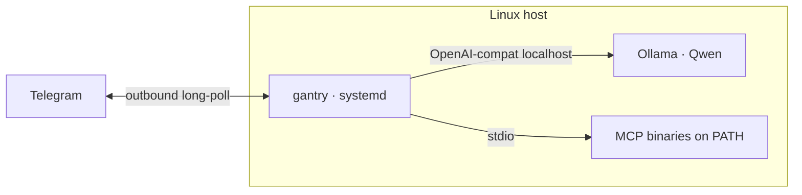

# Deploy: Native (Linux + systemd + local model)

Run the same **static `gantry` binary** on the host under systemd — typically
next to [Ollama](https://ollama.com) and a local chat model (we use
**Qwen** in production). No Docker on the agent box; MCP tools are plain
binaries on `PATH`.

Kernel contract: [root readme](../readme.md). Tool naming: [mcp.md](mcp.md).
Appliance Make targets / host layout: [local-agent/deploy/README.md](../local-agent/deploy/README.md).



---

## Why native + local models

| Goal | Native path |
| --- | --- |
| Own the weights | Ollama (or any OpenAI-compat) on the same box |
| Skip container tax | One process, journald logs, host networking for Cast/mDNS |
| Same agent contract | Identical env + persona + `mcp.toml` as Docker |

Cloud LLMs still work (`LLM_*` → Gemini/Grok). Native shines when the brain
is local and you care about RAM, keep-alive, and tool-call quality.

---

## Featured stack (local-agent appliance)

Production shape we run today:

| Piece | Choice |
| --- | --- |
| Chat | Ollama · `qwen3.5:35b-a3b` (or current pin) |
| Channel | Telegram allowlist |
| Supervisor | systemd unit under `/opt/gantry` |
| Tools | Garmin, Workspace, search, Cast, … via `mcp.toml` |

Workstation → remote host:

```bash
cd local-agent
# .env: DEPLOY_HOST, DEPLOY_USER, DEPLOY_PATH=/opt/gantry, Telegram, …

make remote-native-env      # gantry.env with Ollama LLM_* defaults
make remote-native-check
make remote-native-deploy   # release binary → install → systemctl start
# day-to-day from a dirty tree:
make remote-native-deploy-dev
```

Host layout, secrets under `data/.config/`, cutover from Docker TIM:
**[local-agent/deploy/README.md](../local-agent/deploy/README.md)**.

Minimal `LLM_*` for Ollama on the same machine:

```env
LLM_BASE_URL=http://127.0.0.1:11434/v1
LLM_API_KEY=ollama
LLM_MODEL=qwen3.5:35b-a3b
```

---

## How gantry tackles local-model rough edges

Small / thinking models (Qwen) are great offline brains but messy with tools.
The kernel hardens the loop so Tim finishes multi-step turns:

| Failure mode | What gantry does |
| --- | --- |
| Fat MCP catalogs drown Flash/Qwen | Manifest `tools` / `exclude` + MCP `--tool-tier` (e.g. Garmin `core`) |
| Hyphenated prefix mangled to underscores (`google_search__…`) | Host aliases prefix `_`→`-` when the catalog matches ([mcp.md](mcp.md)) |
| Invented tool names (`…__web_search`) | Model-facing catalog suggestions on unknown tools |
| Answer stuck in CoT after a successful tool | Promote thinking → user reply (no ERROR stall) |
| Prompt cache thrash | Stable message prefix (persona / summary / history); volatile blocks last |
| Schema token blowups | `TOOL_SCHEMA_MAX_TOKENS` + boot `est_tokens` logging |

Persona still spells exact names (`TOOLS.md`). Runtime fixes catch the rest.

Open follow-ups (token truncation, eval harness): [native_plan_todo.md](../native_plan_todo.md).

---

## REPL / hack loop (no systemd)

From the repo root, against any OpenAI-compat endpoint (including Ollama):

```bash
make init
# deploy/mcp.toml + .env — set LLM_* to Ollama or Gemini
make run    # CHANNEL=stdio
```

`/status` · `/tools` · ask for a dated tool call. See [mcp.md](mcp.md).

---

## When to prefer native

| Prefer native when… | Prefer [Docker](deploy-docker.md) when… |
| --- | --- |
| Ollama/Qwen (or other local) on a mini-PC | Hub image + compose is enough |
| Cast / LAN tools want host network simply | Distroless grant story matters most |
| You already live in systemd + journalctl | Workstation has Docker; server gets `remote-deploy` |

Same binary, same mounts-or-paths contract — only the supervisor changes.
