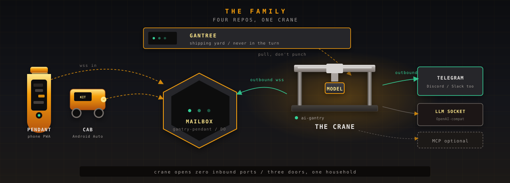

# The family

Four public repos. **This one is the product** — the crane. The others
exist so you can operate it and talk to it without anyone sitting in a
token path.

Pitch: [root readme](../readme.md). Internal loop:
[architecture.md](architecture.md). Yard contract:
[gantree-contract.md](gantree-contract.md). Mouths:
[channels.md](channels.md).

<p align="center">
  
</p>

---

## Who does what

| Repo | Job | Knows a person as |
| --- | --- | --- |
| **[ai-gantry](https://github.com/shotah/ai-gantry)** (this tree) | The agent. One process, one persona, one OpenAI-compat model, optional MCP children. | Allowlist in env (`TELEGRAM_ALLOWED_USERS`, `PENDANT_ALLOWED_USERS`, …). Fail closed. |
| **[gantree](https://github.com/shotah/gantree)** | Shipping yard. Board, grants, doctor, spend, build-a-crane. | Operator row: passphrase, role, assigned cranes. Not a chat login. |
| **[gantry-pendant](https://github.com/shotah/gantry-pendant)** | Handheld PWA + Cloudflare Durable Object mailbox. | Google `sub` (human) or crane bearer (machine). Room list comes from the crane. |
| **[gantry-cab](https://github.com/shotah/gantry-cab)** | Android Auto / phone APK. Same mailbox, not a second Worker. | Same Google `sub` as the PWA. |

Telegram, Discord, and Slack are **vendor mouths**. The crane dials them
the way it always has. They are not sibling git repos.

MCP binaries (`google-mcp`, `go-strava-mcp`, `pendant-mcp`, …) are
**optional children** on `PATH`. Listed in `mcp.toml` is the grant.
Omit the row and that capability does not exist. They are not a fifth
product.

`gantry-fleet` is personal ops for one household — not a public
product.

---

## How they talk

Nothing on the crane listens. Two chat paths, one operator plane:

```text
phone PWA  ──wss in──┐
gantry-cab ──wss in──┤
                     ▼
              gantry-pendant          ai-gantry (the crane)
              Durable Object  ◄─ outbound wss ─┤
              mailbox / slug                     ├─ outbound ──► Telegram / Discord / Slack
                                                 ├─ OpenAI-compat LLM
                                                 └─ stdio MCP children (optional)

browser ──► gantree (localhost | Tailscale | tunnel)
                 │
                 └── writes files + docker ──►  gantry  gantry  gantry
                     (never in a chat turn)
```

| Wire | From | To | What moves |
| --- | --- | --- | --- |
| Outbound WSS | crane `CHANNEL=pendant` | Worker `/ws/<slug>` | Chat frames, `allow` list, cron push. Bearer is per crane. |
| Inbound WSS | pendant PWA / cab | same mailbox | Human turns. Google session (PWA cookie or cab JWE). |
| Long-poll / Gateway / Socket Mode | crane | Telegram / Discord / Slack | Default production mouth. No mailbox. |
| Files + Docker | gantree | crane mounts | `.env`, `mcp.toml`, `PERSONA.md`, compose recreate. `docker logs` / `gantry status` the other way. |
| Completer HTTP | crane | `LLM_BASE_URL` | One vendor socket. Swap the model; the loop stays. |
| MCP stdio | crane | child binaries | Tool calls. Inherit process env unless the manifest overrides. |

The crane never learns the yard exists. The Worker never sees the
yard cookie. Gantree never sits in a Completer round.

Yard-side access (operators vs humans on the mouth):
[gantree access](https://github.com/shotah/gantree/blob/main/docs/access.md).
Pendant wire: [pendant architecture](https://github.com/shotah/gantry-pendant/blob/main/docs/architecture.md).

---

## Three doors, one household

The three were built independent on purpose. Do not merge them.

| Door | Where | Credential | Who it lets in |
| --- | --- | --- | --- |
| Yard | gantree `/login` | operator passphrase | people who may **operate** cranes |
| Mailbox | pendant Worker | Google OIDC or crane bearer | who may **join the room** (list from the crane) |
| Mouth | crane `.env` | Telegram id / Discord id / Slack id / Google `sub` | who the **agent will answer** |

Bob can operate Kit and never message her. Ada can message Kit from her
phone and never see the board. Yank a person = edit `.env` + recreate.

---

## Nested checkouts

Under a gantree working tree, `repos/ai-gantry`, `repos/gantry-pendant`,
and `repos/gantry-cab` are **dev only**. Each keeps its own remote.
Runtime pins `shotah/ai-gantry:latest` and speaks the file/env contract.
Do not copy `.env` or `data/` from a private checkout.

What the yard may write against this binary:
[gantree-contract.md](gantree-contract.md).
