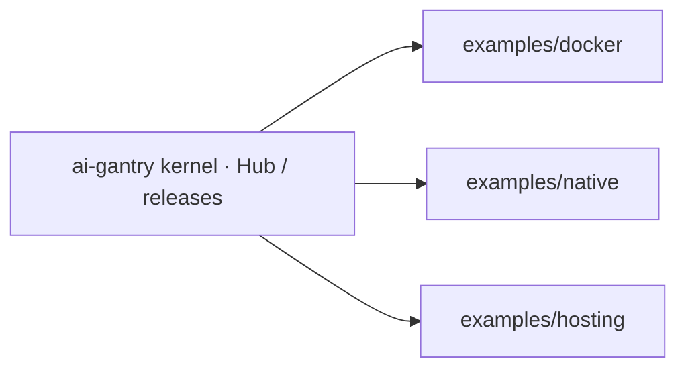

# examples/

Three **template consumer repositories** for [ai-gantry](https://github.com/shotah/ai-gantry).
Each directory is shaped like a standalone git repo that **consumes** the published
kernel (Hub image or release binary) — not a checkout of the kernel itself.

| Template | Consumes | Supervisor |
| --- | --- | --- |
| [`docker/`](docker/) → *gantry-compose* | `shotah/ai-gantry` image | Docker Compose |
| [`native/`](native/) → *gantry-native* | release binary | systemd |
| [`hosting/`](hosting/) → *gantry-gce* | Hub image on GCE | Compose + optional Actions |

Also here (kernel scaffolding, not consumer templates):

| Path | Role |
| --- | --- |
| [`persona/*.example.md`](persona/) | Embedded by `gantry init` in the kernel repo |
| [`mcp.toml.example`](mcp.toml.example) / [`env.example`](env.example) | Same |

Production appliance with tools baked in:
[`../local-agent/`](../local-agent/).



## Use as a separate repo

1. Copy one template directory to a new remote (or publish it as a GitHub template).
2. `make init` inside that tree — seeds `persona/*.md` and `.env` / `gantry.env`.
3. Set channel + LLM secrets; follow that template’s README.

Inside this monorepo, the same seed helpers exist from the kernel root:

```bash
make example-docker
make example-native
make example-hosting
```

## Pick a template

| Goal | Template |
| --- | --- |
| Laptop / any Docker host, Gemini + Telegram | [`docker/`](docker/) |
| Linux mini-PC, Ollama, systemd | [`native/`](native/) |
| Always-on VM in an existing GCP project | [`hosting/`](hosting/) |

All three share the kernel contract: env + `persona/` + `mcp.toml` +
`$DATA_DIR/gantry.db`. No inbound app ports — chat channels dial out only.
