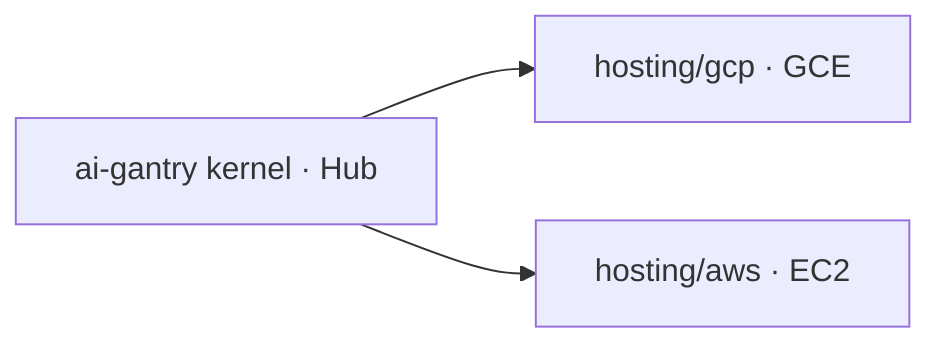

# Cloud VM hosting templates

Consumer templates that run the published [`shotah/ai-gantry`](https://hub.docker.com/r/shotah/ai-gantry)
kernel on a small **always-on VM** with Docker Compose. Same contract as
[`examples/docker/`](../docker/) — persona, `mcp.toml`, and SQLite stay in the
consumer repo. Chat channels dial **out** only (no app inbound ports).

| Template | Cloud | Supervisor |
| --- | --- | --- |
| [`gcp/`](gcp/) → *gantry-gce* | Google Compute Engine | Compose + optional Actions (`deploy-gce.yml`) |
| [`aws/`](aws/) → *gantry-ec2* | Amazon EC2 | Compose + optional Actions (`deploy-ec2.yml`) |

Skip request-shaped runtimes (Cloud Run, Lambda, App Runner) — poor fit for
long-poll chat + local SQLite.



Upstream: [deploy-docker](../../docs/deploy-docker.md).
Siblings: [compose](../docker/) · [native](../native/).

## Pick a cloud

| Goal | Template |
| --- | --- |
| Already on GCP (Gemini / Workspace APIs) | [`gcp/`](gcp/) |
| Already on AWS (or prefer EC2 + SSM) | [`aws/`](aws/) |

Both use `/opt/gantry-hosting` on the VM by default. Seed locally with
`make init` inside the template, set `.env`, copy once to the VM, then
`docker compose up -d`. CI only **pulls and restarts** the image.

Inside this monorepo:

```bash
make example-hosting-gcp
make example-hosting-aws
# or: make example-hosting   # prints both
```

Baking MCP tools into a custom image needs a slightly larger instance
(`e2-small` / `t3.small` or bigger). A full life-stack lives in a consumer
repo (persona + MCP + compose), not this kernel.
