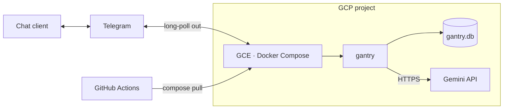
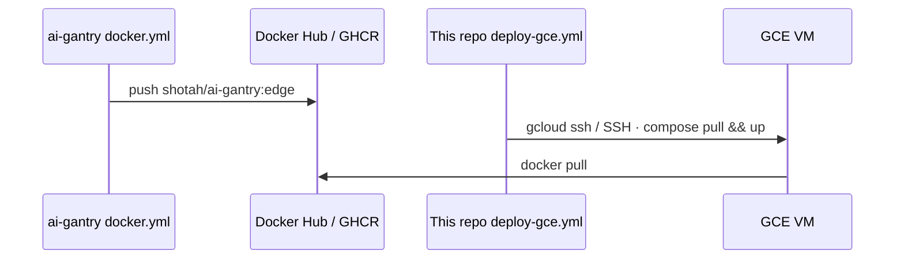

# gantry-gce

Template **consumer** repository for [ai-gantry](https://github.com/shotah/ai-gantry)
on **Google Compute Engine**. Same Compose contract as [gantry-compose](../docker/),
aimed at a GCP project that already uses Gemini / Workspace / search APIs.

| Consumes | [`shotah/ai-gantry`](https://hub.docker.com/r/shotah/ai-gantry) on a small GCE VM |
| Channel | Telegram by default |
| CI | Optional `.github/workflows/deploy-gce.yml` — pull + restart after image publish |

Skip Cloud Run (request-shaped; poor fit for polling + SQLite). Prefer a tiny
always-on VM + Docker. Chat channels dial **out** only — no app inbound ports.



Upstream: [deploy-docker](https://github.com/shotah/ai-gantry/blob/main/docs/deploy-docker.md).
Siblings: [compose](../docker/) · [native](../native/).

## Layout

```text
.
  compose.yml
  .env.example
  mcp.toml
  persona/*.example.md
  data/
  Makefile
  .github/workflows/deploy-gce.yml
```

## 1. Create the VM (once)

```bash
export PROJECT_ID=my-gcp-project
export ZONE=us-west1-b
export INSTANCE=gantry

gcloud config set project "$PROJECT_ID"

gcloud compute instances create "$INSTANCE" \
  --zone="$ZONE" \
  --machine-type=e2-micro \
  --image-family=ubuntu-2404-lts-amd64 \
  --image-project=ubuntu-os-cloud \
  --boot-disk-size=20GB \
  --boot-disk-type=pd-standard \
  --tags=gantry \
  --metadata=enable-oslogin=TRUE
```

`e2-micro` (Always Free in `us-west1` / `us-central1` / `us-east1`) is tight.
On OOM, resize to `e2-small`. Default VPC SSH is enough; do not open 80/443 for gantry.

## 2. Docker on the VM

```bash
gcloud compute ssh "$INSTANCE" --zone="$ZONE" --command='
  set -euo pipefail
  sudo apt-get update
  sudo apt-get install -y ca-certificates curl
  sudo install -m 0755 -d /etc/apt/keyrings
  curl -fsSL https://download.docker.com/linux/ubuntu/gpg | sudo tee /etc/apt/keyrings/docker.asc >/dev/null
  sudo chmod a+r /etc/apt/keyrings/docker.asc
  . /etc/os-release
  echo "deb [arch=$(dpkg --print-architecture) signed-by=/etc/apt/keyrings/docker.asc] https://download.docker.com/linux/ubuntu $VERSION_CODENAME stable" \
    | sudo tee /etc/apt/sources.list.d/docker.list >/dev/null
  sudo apt-get update
  sudo apt-get install -y docker-ce docker-ce-cli containerd.io docker-compose-plugin
  sudo usermod -aG docker "$USER"
  sudo mkdir -p /opt/gantry-hosting
  sudo chown "$USER:$USER" /opt/gantry-hosting
'
```

Open a new SSH session so the `docker` group applies.

## 3. Seed and copy this repo onto the VM

```bash
make init
# Set GEMINI_API_KEY / TELEGRAM_* in .env

gcloud compute scp --recurse --zone="$ZONE" \
  ./ "$INSTANCE":/opt/gantry-hosting/
```

When this tree is its own git remote, clone on the VM instead of `scp`.

## 4. Up

```bash
gcloud compute ssh "$INSTANCE" --zone="$ZONE" --command='
  cd /opt/gantry-hosting
  docker compose pull
  docker compose up -d
  docker compose ps
'
```

| Task | Command |
| --- | --- |
| Logs | `gcloud compute ssh $INSTANCE --zone=$ZONE --command='cd /opt/gantry-hosting && docker compose logs -f'` |
| Heartbeat | `… docker compose exec gantry /usr/local/bin/gantry status` |

---

## GitHub Actions redeploy

Upstream [ai-gantry `docker` workflow](https://github.com/shotah/ai-gantry/blob/main/.github/workflows/docker.yml)
publishes `:edge` / `:latest`. This consumer’s workflow only **pulls and restarts**
on the VM — it does not build the kernel.



Wire either **Workload Identity Federation** or **plain SSH** (see comments in
[`.github/workflows/deploy-gce.yml`](.github/workflows/deploy-gce.yml)):

| Name | Kind | Purpose |
| --- | --- | --- |
| `GCP_WORKLOAD_IDENTITY_PROVIDER` | secret | WIF provider |
| `GCP_SERVICE_ACCOUNT` | secret | Deploy SA email |
| `GCE_INSTANCE` / `GCE_ZONE` | variables | VM target |
| `GCE_DEPLOY_PATH` | variable | default `/opt/gantry-hosting` |
| *or* `GCE_SSH_KEY` + `GCE_HOST` | secret / var | SSH path |

Triggers: `workflow_dispatch`, or `workflow_run` of a workflow named `docker`
(when that job lives in **this** consumer repo — e.g. a thin mirror that only
watches upstream — or retarget `workflows:` to match). For a consumer that only
redeploys when upstream publishes, prefer `workflow_dispatch` / scheduled
`docker compose pull`, or a `repository_dispatch` from upstream.

First boot still needs `.env` and persona on disk; CI refreshes the **image** only.

---

## Publishing this template

Promote this directory to its own GitHub repository (template or plain). Enable
Actions secrets/variables above. Pin `image:` in `compose.yml` for production.

Full life-stack (tools baked in) on the same VM:
[ai-gantry/local-agent](https://github.com/shotah/ai-gantry/tree/main/local-agent)
— prefer `e2-small` or larger.
