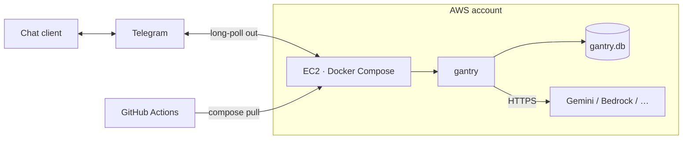
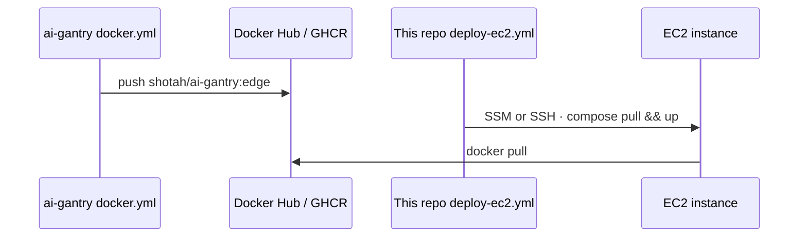

# gantry-ec2

Template **consumer** repository for [ai-gantry](https://github.com/shotah/ai-gantry)
on **Amazon EC2**. Same Compose contract as [gantry-compose](../../docker/),
aimed at an AWS account that already uses Bedrock / other APIs — or plain
Gemini over HTTPS (no AWS LLM required).

| Consumes | [`shotah/ai-gantry`](https://hub.docker.com/r/shotah/ai-gantry) on a small EC2 instance |
| Channel | Telegram by default |
| CI | Optional `.github/workflows/deploy-ec2.yml` — pull + restart after image publish |

Skip Lambda / App Runner (request-shaped; poor fit for polling + SQLite). Prefer a
tiny always-on instance + Docker — long-horizon planning needs the process still
there tomorrow. Chat channels dial **out** only — no app inbound ports.



Upstream: [deploy-docker](https://github.com/shotah/ai-gantry/blob/main/docs/deploy-docker.md).
Siblings: [gcp](../gcp/) · [compose](../../docker/) · [native](../../native/).
Index: [examples/hosting/](../).

## Layout

```text
.
  compose.yml
  .env.example
  mcp.toml
  persona/*.example.md
  data/
  Makefile
  .github/workflows/deploy-ec2.yml
```

## 1. Create the instance (once)

Ubuntu 24.04 in a public subnet with SSH (or SSM) from your admin IP only.
Do **not** open 80/443 for gantry.

```bash
export AWS_REGION=us-west-2
export KEY_NAME=gantry   # existing EC2 key pair
export SG_ID=sg-xxxxxxxx # SSH (22) or SSM-only from your IP / VPC

# Latest Ubuntu 24.04 AMD64 in this region (adjust arch if you use ARM)
AMI_ID=$(aws ec2 describe-images --region "$AWS_REGION" --owners 099720109477 \
  --filters "Name=name,Values=ubuntu/images/hvm-ssd-gp3/ubuntu-noble-24.04-amd64-server-*" \
            "Name=state,Values=available" \
  --query 'sort_by(Images,&CreationDate)[-1].ImageId' --output text)

aws ec2 run-instances \
  --region "$AWS_REGION" \
  --image-id "$AMI_ID" \
  --instance-type t3.micro \
  --key-name "$KEY_NAME" \
  --security-group-ids "$SG_ID" \
  --tag-specifications 'ResourceType=instance,Tags=[{Key=Name,Value=gantry}]' \
  --block-device-mappings '[{"DeviceName":"/dev/sda1","Ebs":{"VolumeSize":20,"VolumeType":"gp3"}}]'
```

`t3.micro` is tight (Free Tier eligible in many accounts). On OOM, resize to
`t3.small`. For ARM, use `t4g.micro` + an `arm64` AMI and the matching
`shotah/ai-gantry` image arch.

Note the instance id and public DNS/IP:

```bash
aws ec2 describe-instances --region "$AWS_REGION" \
  --filters "Name=tag:Name,Values=gantry" "Name=instance-state-name,Values=running" \
  --query 'Reservations[0].Instances[0].[InstanceId,PublicDnsName,PublicIpAddress]' \
  --output text
```

## 2. Docker on the instance

```bash
export INSTANCE_HOST=ec2-…compute.amazonaws.com   # or public IP
export SSH_USER=ubuntu

ssh "${SSH_USER}@${INSTANCE_HOST}" '
  set -euo pipefail
  sudo apt-get update
  sudo apt-get install -y ca-certificates curl
  sudo install -m 0755 -d /etc/apt/keyrings
  curl -fsSL https://download.docker.com/linux/ubuntu/gpg | sudo tee /etc/apt/keyrings/docker.asc >/dev/null
  sudo chmod a+r /etc/apt/keyrings/docker.asc
  . /etc/os-release
  echo "deb [arch=$(dpkg --print-architecture) signed-by=/etc/apt/keyrings/docker.asc] https://download.docker.com/linux/ubuntu $VERSION_CODENAME stable" \
    | sudo tee /etc/apt/sources.list.d/docker.list >/dev/null
  sudo apt-get update
  sudo apt-get install -y docker-ce docker-ce-cli containerd.io docker-compose-plugin
  sudo usermod -aG docker "$USER"
  sudo mkdir -p /opt/gantry-hosting
  sudo chown "$USER:$USER" /opt/gantry-hosting
'
```

Open a new SSH session so the `docker` group applies.

Optional (CI via SSM): attach an IAM instance profile with
`AmazonSSMManagedInstanceCore` and ensure the SSM agent is running.

## 3. Seed and copy this repo onto the instance

```bash
make init
# Set GEMINI_API_KEY / TELEGRAM_* in .env
# (or LLM_* for Bedrock OpenAI-compat / other providers)

scp -r ./ "${SSH_USER}@${INSTANCE_HOST}:/opt/gantry-hosting/"
```

When this tree is its own git remote, clone on the instance instead of `scp`.

## 4. Up

```bash
ssh "${SSH_USER}@${INSTANCE_HOST}" '
  cd /opt/gantry-hosting
  docker compose pull
  docker compose up -d
  docker compose ps
'
```

| Task | Command |
| --- | --- |
| Logs | `ssh $SSH_USER@$INSTANCE_HOST 'cd /opt/gantry-hosting && docker compose logs -f'` |
| Heartbeat | `… docker compose exec gantry /usr/local/bin/gantry status` |

---

## GitHub Actions redeploy

Upstream [ai-gantry `docker` workflow](https://github.com/shotah/ai-gantry/blob/main/.github/workflows/docker.yml)
publishes `:edge` / `:latest`. This consumer’s workflow only **pulls and restarts**
on the instance — it does not build the harness.



Wire either **OIDC → AWS + SSM** or **plain SSH** (see comments in
[`.github/workflows/deploy-ec2.yml`](.github/workflows/deploy-ec2.yml)):

| Name | Kind | Purpose |
| --- | --- | --- |
| `AWS_ROLE_TO_ASSUME` | secret | IAM role for GitHub OIDC |
| `AWS_REGION` | variable | e.g. `us-west-2` |
| `EC2_INSTANCE_ID` | variable | `i-…` |
| `EC2_DEPLOY_PATH` | variable | default `/opt/gantry-hosting` |
| *or* `EC2_SSH_KEY` + `EC2_HOST` | secret / var | SSH path |
| `EC2_SSH_USER` | variable | default `ubuntu` |

Triggers: `workflow_dispatch`, schedule, or `repository_dispatch` (`gantry-redeploy`).
For a consumer that only redeploys when upstream publishes, prefer
`workflow_dispatch` / scheduled `docker compose pull`, or a
`repository_dispatch` from upstream.

First boot still needs `.env` and persona on disk; CI refreshes the **image** only.

---

## Publishing this template

Promote this directory to its own GitHub repository (template or plain). Enable
Actions secrets/variables above. Pin `image:` in `compose.yml` for production.

Baking MCP tools into a custom image on the same instance wants
`t3.small` / `t4g.small` or larger.
