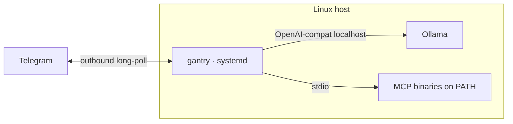

# gantry-native

Template **consumer** repository for [ai-gantry](https://github.com/shotah/ai-gantry).
Installs the static release binary under systemd — no Docker, no kernel checkout.
Default LLM is **Ollama on localhost**; `LLM_*` can point at Gemini/Grok instead.

| Consumes | `gantry` from [GitHub Releases](https://github.com/shotah/ai-gantry/releases) |
| Channel | Telegram by default |
| Supervisor | systemd → `/opt/gantry` |

Upstream docs: [deploy-native](https://github.com/shotah/ai-gantry/blob/main/docs/deploy-native.md).
Sibling templates: [compose (Docker)](../docker/) · [hosting (GCP · AWS)](../hosting/).



## Layout

```text
.
  gantry.service       # → /etc/systemd/system/gantry.service
  gantry.env.example   # → gantry.env (secrets)
  install.sh           # user, dirs, binary, unit
  mcp.toml
  persona/*.example.md
  data/
  Makefile             # init
```

## Quick start

On a workstation (optional seed), then on the Linux host:

```bash
make init
# Set TELEGRAM_* and LLM_* in gantry.env

# On Ubuntu/Debian:
curl -fsSL https://ollama.com/install.sh | sh
ollama pull qwen3.6:35b-a3b

sudo ./install.sh
# pin: sudo GANTRY_VERSION=0.x.y ./install.sh

sudo systemctl status gantry
journalctl -u gantry -f
```

`install.sh` downloads the latest `gantry` release, installs this tree’s
`gantry.env` / `mcp.toml` / `persona/` into `/opt/gantry`, and enables the unit.

### Cloud LLM instead of Ollama

```env
LLM_BASE_URL=https://generativelanguage.googleapis.com/v1beta/openai
LLM_API_KEY=...
LLM_MODEL=gemini-3.5-flash
```

Drop `Requires=ollama.service` from `gantry.service` before enable, or leave
Ollama installed unused.

### MCP tools

```bash
sudo -u gantry /opt/gantry/gantry tools-fetch \
  --manifest /opt/gantry/mcp.toml --outdir /opt/gantry/bin
# uncomment [[server]] blocks in mcp.toml
sudo systemctl restart gantry
```

A full life-stack is a separate consumer repo, not this template.

## Day-to-day

| Task | Command |
| --- | --- |
| Logs | `journalctl -u gantry -f` |
| Restart | `sudo systemctl restart gantry` |
| Reload persona | `sudo systemctl kill -s HUP gantry` |
| Heartbeat | `sudo -u gantry /opt/gantry/gantry status` |

## Publishing this template

Copy this directory into a new git remote. Keep `gantry.env` and filled
`persona/*.md` out of git (see `.gitignore`). Pin `GANTRY_VERSION` in deploy
docs or CI for reproducible hosts.
