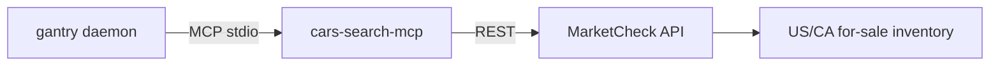

# Cars (MarketCheck inventory)

gantry has no built-in car search (by design — capabilities are MCP binaries).
We ship
[`cars-search-mcp`](https://github.com/shotah/cars-search-mcp)
— a **static Go** MCP that calls the **MarketCheck** Cars API.
Search + recommend + **listing handoff**; it never submits leads or purchases.



Dealer inventory by default; FSBO / auction are opt-in. **Not** motorcycle /
RV / heavy equipment yet.

Free MarketCheck plan is about **500 calls / month** (100-mile radius cap) —
see [pricing](https://www.marketcheck.com/apis/pricing/).

Agent recipes live in `persona/TOOLS.md` (and `TOOLS.example.md`).

---

## Setup

1. Create a [MarketCheck](https://www.marketcheck.com/apis/cars/) account and
   copy an API key.
2. Put it in `.env`:

```bash
MARKETCHECK_API_KEY=...
# Optional pin (Docker bake / native fetch):
# CARS_SEARCH_MCP_VERSION=v0.0.1
# Persist local usage counter on the gantry volume:
# MARKETCHECK_USAGE_FILE=/data/marketcheck-usage.json
```

3. **Native:** regenerate host env (`.env` alone is not enough):

```bash
make remote-native-env
make remote-native-deploy-dev   # or deploy-dev-quick if bin already current
```

Docker:

```bash
make build && make up
```

---

## Config wiring

`mcp.toml` (listed = granted):

```toml
[[server]]
name = "cars"
command = "cars-search-mcp"
download_tag = "latest"
download_url = "https://github.com/shotah/cars-search-mcp/releases/download/{tag}/cars-search-mcp_{version}_{os}_{arch}.tar.gz"
```

| Tool | Host name | Use |
| --- | --- | --- |
| `listings_search` | `cars__listings_search` | Zip/city + make/model/year/price/miles |
| `listings_get` | `cars__listings_get` | One listing by id |
| `vin_get` | `cars__vin_get` | VIN decode / lookup |
| `markets_get` | `cars__markets_get` | Market / days-supply style context |
| `link_format` | `cars__link_format` | Fallback *search* URL only (no API) |
| `account_get` | `cars__account_get` | Local usage counter + dashboard |

Tool names follow
[mcp-naming.md](../../docs/mcp-naming.md) — **no** `cars_listings_search`.

Host prefix disambiguates from rentals: `cars__listings_search` vs
`rentals__listings_search`.

**Handoff path:** present VDP / dealer URL. Never submit leads or call dealers.

---

## Agent flow

```text
listings_search → [listings_get] → hand off listing / dealer URL
            ↘ vin_get / markets_get for context
```

---

## Cost (ballpark)

MarketCheck free ≈ **500 calls / month**. Prefer one tight `listings_search`.
`link_format` and `account_get` do not burn MarketCheck quota. Local `usage`
can undercount if the usage file is not on a persistent volume — dashboard is
source of truth.

---

## Smoke tests

```bash
make build
docker compose run --rm --entrypoint cars-search-mcp gantry --version
docker compose run --rm --entrypoint cars-search-mcp gantry --self-test
# Real search needs MARKETCHECK_API_KEY — try Telegram:
# “used Toyota Camry under $18k within 50 miles of 98101”
```

Native: `gantry tools-plan` / `make remote-native-fetch` picks up `download_url`.

---

## Troubleshooting

| Symptom | Fix |
| --- | --- |
| LOCAL_AGENT doesn’t see car tools | Check `[[server]]` in `mcp.toml`; rebuild/fetch so `cars-search-mcp` is on PATH; `/tools` should list `cars__listings_search` |
| Tools error about missing API key | Set `MARKETCHECK_API_KEY` in `.env`, then `make remote-native-env` + redeploy (native) or recreate compose |
| Image build fails in cars stage | Publish a **GitHub Release** on [cars-search-mcp](https://github.com/shotah/cars-search-mcp/releases); or pin `CARS_SEARCH_MCP_VERSION` |
| Confused with apartment search | Use `cars__…` not `rentals__…` |
| Rate / quota errors | Tighten filters; check MarketCheck dashboard or `cars__account_get` |
