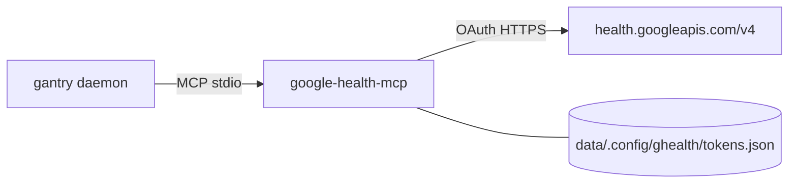

# Google Health (Fitbit / Pixel Watch)

Give LOCAL_AGENT sleep, exercise, resting HR, HRV, and weight from modern
**Fitbit / Pixel Watch** devices via
[google-health-mcp](https://github.com/shotah/google-health-mcp)
(`google-health-mcp` binary). Uses the
[Google Health API](https://developers.google.com/health/about)
(`health.googleapis.com/v4`) — **not** the legacy Fitbit Web API (EOS ~Sept 2026)
and **not** Google Fit REST.

Chris stays on Garmin (`garmin__…`). Friends on the new Google/Fitbit line use
the same recipes with the `ghealth__` prefix.



---

## What LOCAL_AGENT can do

Tools reach the model as `ghealth__…`:

| Ask | Tool (host form) |
|---|---|
| "How did I sleep last night?" | `ghealth__sleep_get` |
| "What's my resting HR / HRV?" | `ghealth__heart_rate_get`, `ghealth__hrv_get` |
| "What did I do this week?" | `ghealth__activities_list`, then `ghealth__activities_get` |
| "What's my weight trend?" | `ghealth__weight_get` |
| "Which account is connected?" | `ghealth__profile_get`, `ghealth__account_get` |

Default date behavior matches Garmin recipes: “last night” → omit date or pass
**today** (wake-up day). Prefer reconcile + `google-wearables` (Fitbit trackers /
Pixel Watch).

---

## 1. GCP OAuth client

1. Personal GCP project →
   [enable Google Health API](https://console.cloud.google.com/apis/library/health.googleapis.com)
   ([setup](https://developers.google.com/health/setup)).
2. Create an OAuth **Web** client; authorized redirect URI:
   `http://127.0.0.1:4101/oauth2callback`
   (fixed port — distinct from Workspace google-mcp on `:4100`).
3. Data Access page: request **readonly** scopes (Restricted — testing capped
   ~100 users until verification):

```text
https://www.googleapis.com/auth/googlehealth.sleep.readonly
https://www.googleapis.com/auth/googlehealth.activity_and_fitness.readonly
https://www.googleapis.com/auth/googlehealth.health_metrics_and_measurements.readonly
https://www.googleapis.com/auth/googlehealth.profile.readonly
```

Do **not** mix legacy `fitness.*` scopes on the same client.

---

## 2. `.env` / `gantry.env`

```env
GOOGLE_HEALTH_CLIENT_ID=...
GOOGLE_HEALTH_CLIENT_SECRET=...
# Docker compose sets TOKEN_PATH; native example:
# GOOGLE_HEALTH_TOKEN_PATH=/opt/gantry/data/.config/ghealth/tokens.json
```

---

## 3. Authorize once (`make ghealth-auth`)

```bash
make ghealth-auth
```

That runs `gantry auth ghealth` → `google-health-mcp auth` (PKCE + loopback on
`:4101`, published via Compose). Tokens land in
`data/.config/ghealth/tokens.json`. If `DEPLOY_HOST` is set,
`make ghealth-sync` also runs.

---

## 4. mcp.toml

```toml
[[server]]
name = "ghealth"
command = "google-health-mcp"
auth_args = ["auth"]
download_tag = "latest"
download_url = "https://github.com/shotah/google-health-mcp/releases/download/{tag}/google-health-mcp_{version}_{os}_{arch}.tar.gz"
```

Boot is fail-soft: missing tokens do **not** block MCP `initialize`.

---

## Troubleshooting

| Symptom | Fix |
|---|---|
| Auth required on data tools | `make ghealth-auth` (or `gantry auth ghealth`) |
| 401 after weeks | Re-run auth (refresh token revoked / expired) |
| Empty sleep / HR | Wearable not syncing in Fitbit app; check `ghealth__account_get` |
| Wrong account | `ghealth__profile_get` shows Fitbit + Google health user ids |
