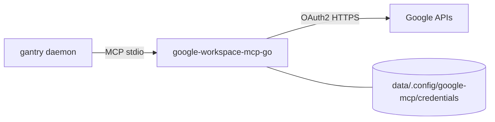

# Google Workspace (Gmail / Calendar / Docs / Drive)

LOCAL_AGENT talks to Google through a **compiled Go MCP binary** we maintain:
[`shotah/google-workspace-mcp-go`](https://github.com/shotah/google-workspace-mcp-go)
(fork of magks; releases fetched like the other shotah MCPs — Docker bake +
native `download_url`).

gantry has no built-in Google tooling — this MCP **is** the Workspace
integration. (The old `gws` CLI is gone from the image: it needs glibc and the
runtime is now distroless/static.)



---

## What LOCAL_AGENT can do (core tier)

Config loads `--tools gmail drive calendar docs sheets tasks contacts` with
`--tool-tier core` (~45 tools). Useful examples:

| Ask | Tool (approx.) |
|---|---|
| “What’s unread?” | `search_gmail_messages` / `get_gmail_message_content` |
| “What’s on my calendar Friday?” | `get_events` |
| “Update the Seattle itinerary doc” | `modify_doc_text` / `find_and_replace_doc` |
| “Create a sheet of …” | `create_spreadsheet` / `modify_sheet_values` |

Bump to `--tool-tier extended` or `complete` in `mcp.toml` if you need
rarer ops (then recreate the container).

---

## 1. OAuth client (once)

1. [Google Cloud Console](https://console.cloud.google.com/) → project
2. Enable APIs you need (Gmail, Calendar, Docs, Drive, Sheets, Tasks, People, …)
3. OAuth consent (External + your Gmail as test user while in Testing)
4. Credentials → OAuth client ID → **Desktop app**
5. Authorized redirect URI (add if prompted):
   `http://localhost:4100/oauth2callback`

Put into `.env`:

```env
GOOGLE_OAUTH_CLIENT_ID=….apps.googleusercontent.com
GOOGLE_OAUTH_CLIENT_SECRET=GOCSPX-…
USER_GOOGLE_EMAIL=you@gmail.com
```

> **Testing vs Production:** OAuth apps in **Testing** expire refresh tokens
> after ~7 days. Move the consent screen to **Production** (or re-run
> `make google-auth` weekly).

---

## 2. Authorize (`make google-auth`)

`google-workspace-mcp-go` has **no** `auth` subcommand yet, so this is not
wired through `gantry auth` (unlike Strava/Garmin/YT Music in `mcp.toml`).
Same pattern as before — **no local `gws`**. Docker runs a throwaway
Python container that:

1. Clears any stale `data/.config/google-mcp/credentials/<email>.json`
2. Prints a Google consent URL
3. Listens on `localhost:4100` for the callback
4. Writes the MCP credential file used at runtime (Docker `./data` and native
   `/opt/gantry/data` share this relative layout)

```bash
make google-auth
```

1. Open the printed URL, approve access.
2. Browser hits `http://localhost:4100/oauth2callback` → container captures the code.
3. On success: `data/.config/google-mcp/credentials/<you@email>.json`

Then deploy. `make google-auth` auto-runs **`make google-sync`** when
`DEPLOY_HOST` is set (`remote-deploy` / `remote-native-deploy` do not copy
Workspace secrets):

```bash
make google-sync              # push data/.config/google-mcp → DEPLOY_PATH (Docker or native)
# or: make build && make up   # local Docker
```

If you still have credentials under legacy `secrets/google-mcp/`, run
`make secrets-migrate` once.

Send **`/new`** in Telegram so LOCAL_AGENT drops any stale auth habit.

Access tokens refresh automatically from the stored `refresh_token`. If Google
revokes the refresh token (or Testing-mode expiry hits), re-run
`make google-auth`.

---

## 3. Config already wired

`mcp.toml` (listed = granted; tools land as `google-workspace__<tool>`).
Exact names matter for local models; underscored prefixes are aliased — see
[../../docs/mcp.md](../../docs/mcp.md).

```toml
[[server]]
name    = "google-workspace"
command = "google-workspace-mcp-go"
args    = [
  "--tools",
  "gmail calendar tasks",
  "--tool-tier",
  "core",
]
download_tag = "latest"
download_url = "https://github.com/shotah/google-workspace-mcp-go/releases/download/{tag}/google-workspace-mcp-go_{version}_{os}_{arch}.tar.gz"
```

Compose mounts `./data` → `/data` (so `data/.config/google-mcp` is
`/data/.config/google-mcp`). Native uses `/opt/gantry/data/.config/google-mcp`.
Both set `WORKSPACE_MCP_CREDENTIALS_DIR`, `GOOGLE_OAUTH_*`, `USER_GOOGLE_EMAIL`.

---

## Legacy: import from `gws` (optional)

If you already have a host `gws` export and prefer not to re-consent:

```bash
make google-mcp-import   # secrets/google/credentials.json → google-mcp format
```

Prefer **`make google-auth`** for new setups (no local gws dependency).

---

## Troubleshooting

- **Docs write fails with “only lowercase…” / `batchUpdate`** — that’s the
  **built-in** tool. Confirm `[google_workspace] enabled = false` and that LOCAL_AGENT
  is using MCP tools (`modify_doc_text`, etc.). `/new` after deploy.
- **MCP auth / 401 / “expired”** — re-run `make google-auth` (pushes via
  `google-sync` if `DEPLOY_HOST` is set). Check OAuth app isn’t stuck in
  Testing (7-day refresh).
- **Callback never completes** — port `4100` free on the host; Desktop client
  allows `http://localhost:4100/oauth2callback`.
- **No `refresh_token` in response** — revoke prior grant at
  [Google Account permissions](https://myaccount.google.com/permissions), then
  `make google-auth` again (`prompt=consent` is already set).
- **LOCAL_AGENT ignores Workspace MCP** — check the `[[server]]` entry in `mcp.toml`
  and rebuild; a failing server fails the boot loudly (`make logs`).
- **Wrong calendar tool name / 404 on `event_id`** — use
  `google-workspace__get_events` with `time_min`/`time_max` (not a hallucinated
  `get_calendar_event`); never put a date range in `event_id`. See
  `persona/TOOLS.md` and [../../docs/mcp.md](../../docs/mcp.md).
- **Too many tools / context bloat** — keep `--tool-tier core`; drop unused
  services from `--tools`.
- **Permission denied on data/.config/** — readable/writable by `GANTRY_UID` (Docker) or `gantry` (native).
