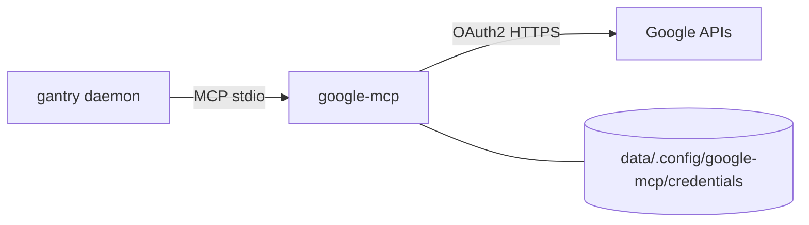

# Google (Gmail / Calendar / Docs / Sheets / Tasks)

LOCAL_AGENT talks to Google through **[`shotah/google-mcp`](https://github.com/shotah/google-mcp)**
(renamed from `google-workspace-mcp-go`). Releases are fetched like the other
shotah MCPs — Docker bake + native `download_url`.

gantry has no built-in Google tooling — this MCP **is** the integration.



Tools reach the model as **`google__{service}_{verb}_…`** (server id `google` +
service-prefixed tool names). Examples: `google__calendar_list_events`,
`google__gmail_search_messages`.

---

## What LOCAL_AGENT can do (`--preset everyday`)

Default `mcp.toml` uses `--preset everyday`: **gmail + calendar + docs + sheets +
tasks**, core tier, edit capability (~23 tools). Drive tools are **not** loaded
(Docs/Sheets work without them).

| Ask | Tool |
|---|---|
| “What’s unread?” | `google__gmail_search_messages` → `google__gmail_get_message` |
| “What’s on my calendar Friday?” | `google__calendar_list_events` |
| “Add climbing tomorrow at 3pm” | `google__calendar_create_event` |
| “Change the location on my 3pm” | `calendar_list_events` → `google__calendar_update_event` |
| “Delete the duplicate / cancel my 3pm” | `calendar_list_events` → `google__calendar_delete_event` |
| “Add a task …” | `google__tasks_create_task` (often `task_list_id="@default"`) |
| “Make me a grocery list” | `google__tasks_create_tasklist` → `google__tasks_create_task` per item |
| “Make / read a Doc” | `google__docs_create` / `google__docs_get_content` |
| “Read / update that Sheet” | `google__sheets_read_values` / `google__sheets_modify_values` |

Tiny models can starve harder with `--preset lean` (gmail + calendar only).
Add `drive` only if SAM needs file search/share/upload.

Upstream naming notes: [shotah/google-mcp TODO](https://github.com/shotah/google-mcp/blob/main/TODO.md).

---

## 1. OAuth client (once)

1. [Google Cloud Console](https://console.cloud.google.com/) → project
2. Enable APIs you need (Gmail, Calendar, Docs, Drive, Sheets, Tasks, …)
3. OAuth consent (External + your Gmail as test user while in Testing)
4. Credentials → OAuth client ID:
   - **Desktop app** — laptop `make google-auth` (`http://localhost:4100/oauth2callback`)
   - **Web application** — chat `/auth google` (required for the GitHub Pages
     catch URI). See **[docs/auth.md](../../docs/auth.md)** for the exact
     redirect and env wiring. You can use one Web client with both redirect
     URIs, or keep Desktop + Web as separate clients.

Put into `.env` (Web client ID/secret if you use chat `/auth`):

```env
GOOGLE_OAUTH_CLIENT_ID=….apps.googleusercontent.com
GOOGLE_OAUTH_CLIENT_SECRET=GOCSPX-…
USER_GOOGLE_EMAIL=you@gmail.com
```

> **Testing vs Production:** OAuth apps in **Testing** expire refresh tokens
> after ~7 days. Move the consent screen to **Production** (or re-auth weekly).

---

## 2. Authorize

**Headless / phone (preferred on a native box):** `/auth google` in Telegram —
open the URL, copy the code from the catch page, paste
`/auth google <code>`. Full guide: **[docs/auth.md](../../docs/auth.md)**.

**Laptop (localhost callback):** run this **on the machine with your browser**
(Docker Desktop is fine). Desktop clients cannot use the Pages catch URI.

```bash
make build          # once, if the appliance image is missing
make google-auth    # prints a URL → approve in browser → tokens under data/.config/
```

Equivalent:

```bash
docker compose run --rm -p 127.0.0.1:4100:4100 \
  --entrypoint /usr/local/bin/gantry gantry auth google
```

Writes `data/.config/google-mcp/credentials/<you@email>.json`. When
`DEPLOY_HOST` is set, `make google-auth` auto-runs **`make google-sync`**.

```bash
make google-sync              # push credentials → DEPLOY_PATH (if you auth'd elsewhere)
```

Send **`/new`** in Telegram so LOCAL_AGENT drops any stale auth habit.

Access tokens refresh automatically from the stored `refresh_token`.

Overview of all MCP browser logins:
[docs/deploy-docker.md § MCP tool auth](../../docs/deploy-docker.md#mcp-tool-auth-browser-oauth).

---

## 3. Config already wired

`mcp.toml` (listed = granted):

```toml
[[server]]
name = "google"
command = "google-mcp"
args = ["--preset", "everyday"]
auth_args = ["auth"]
download_tag = "latest"
download_url = "https://github.com/shotah/google-mcp/releases/download/{tag}/google-mcp_{version}_{os}_{arch}.tar.gz"
```

Compose mounts `./data` → `/data`. Native uses `/opt/gantry/data/.config/google-mcp`.
Both set `WORKSPACE_MCP_CREDENTIALS_DIR`, `GOOGLE_OAUTH_*`, `USER_GOOGLE_EMAIL`.

Exact names matter for local models — see [../../docs/mcp.md](../../docs/mcp.md)
and `persona/TOOLS.md`.

---

## Legacy: import from `gws` (optional)

```bash
make google-mcp-import   # secrets/google/credentials.json → google-mcp format
```

Prefer **`google-mcp auth`** / **`make google-auth`** for new setups.

---

## Troubleshooting

- **MCP auth / 401 / “expired”** — re-run `google-mcp auth` or `make google-auth`.
  Check OAuth app isn’t stuck in Testing (7-day refresh).
- **LOCAL_AGENT ignores Google MCP** — check `name = "google"` / `command = "google-mcp"`
  in `mcp.toml` and refetch/redeploy (`make logs`).
- **Wrong calendar tool / 404 on `event_id`** — use
  `google__calendar_list_events` with `time_min`/`time_max`; never put a date
  range in `event_id`. One event: `google__calendar_get_event`.
- **Still seeing `google-workspace__…`** — old binary or old persona; redeploy
  `google-mcp` + sync `TOOLS.md`, then `/new`.
- **Too many tools** — stay on `--preset everyday` or switch to `lean`.
- **Permission denied on data/.config/** — readable/writable by `GANTRY_UID` (Docker) or `gantry` (native).
