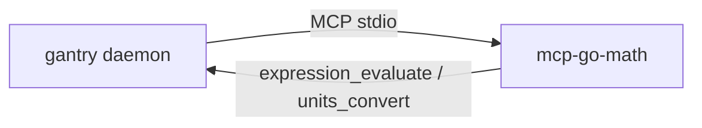

# Math (calculator MCP)

Give LOCAL_AGENT a real calculator via
[mcp-go-math](https://github.com/shotah/mcp-go-math) — a **static Go** MCP
server with two tools. Small local models (Qwen) invent arithmetic in
chain-of-thought; calling a tool ends that.

Upstream: [shotah/mcp-go-math](https://github.com/shotah/mcp-go-math).



---

## What LOCAL_AGENT can do

Tools are prefixed `math__…` (server name `math` in `mcp.toml`):

| Ask | Tool |
|---|---|
| “What’s 17.5% of 240?” / multi-step formulas | `math__expression_evaluate` |
| “Convert 5 miles to km” / lb→kg / F→C | `math__units_convert` |

`expression_evaluate` supports `+ - * / % **` (and `^` as power), parentheses, `pi`/`e`,
and common functions (`sqrt`, `pow`, `sin`, …). Trig uses radians.

---

## 1. Optional `.env` pin

Pinned in the Dockerfile (`v0.0.2`). Override only to freeze/advance:

```env
# MCP_GO_MATH_VERSION=v0.0.2
```

`expression_evaluate` accepts percentages (`17.5% of 240`). For volume: `gallon` is
imperial; use `us_gallon` for US liquid gallons.

---

## 2. `mcp.toml`

```toml
[[server]]
name = "math"
command = "mcp-go-math"
download_tag = "latest"   # or pin "v0.0.2"
download_url = "https://github.com/shotah/mcp-go-math/releases/download/{tag}/mcp-go-math_{version}_{os}_{arch}.tar.gz"
```

`download_tag` is the one place to bump (or `"latest"` while testing).
`{version}` strips the leading `v`. Native deploy GETs the URL
(`gantry tools-plan` → `remote-native-fetch`). No auth. Persona note in
`TOOLS.md`: use the math tool for any arithmetic beyond trivial.

---

## 3. Verify

```bash
make build
docker compose run --rm --entrypoint mcp-go-math gantry --version
docker compose run --rm --entrypoint mcp-go-math gantry --self-test
```

Native host: any `[[server]]` with `download_url` is fetched by
`make remote-native-fetch` / `deploy-dev` into `/opt/gantry/bin`. Add a new
tool = add the block to `mcp.toml` (no script edits).

---

## Troubleshooting

| Symptom | Fix |
|---|---|
| LOCAL_AGENT doesn’t see math tools | Check `[[server]]` in `mcp.toml`; rebuild so `mcp-go-math` is in the image |
| Image build fails in mcp-go-math stage | Publish a release on [shotah/mcp-go-math](https://github.com/shotah/mcp-go-math/releases); or pin `MCP_GO_MATH_VERSION` |
| Model still guesses arithmetic | Reinforce in `TOOLS.md`: use `math__expression_evaluate` for non-trivial math |
