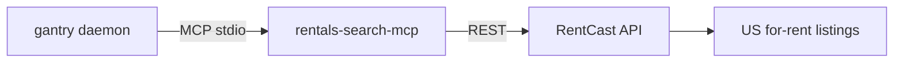

# Rentals (long-term residential via RentCast)

gantry has no built-in apartment search (by design — capabilities are MCP binaries).
We ship
[`rentals-search-mcp`](https://github.com/shotah/rentals-search-mcp)
— a **static Go** MCP that calls the **RentCast** long-term rental API.
Search + recommend + **listing handoff**; it never applies or contacts landlords.



Residential only (apartments, houses, condos, townhomes). **Not** retail /
office / commercial leases — see upstream
[docs/commercial-spaces.md](https://github.com/shotah/rentals-search-mcp/blob/main/docs/commercial-spaces.md).

Free Developer plan is about **50 API requests/month**.

Agent recipes live in `persona/TOOLS.md` (and `TOOLS.example.md`).

---

## Setup

1. Create a [RentCast](https://www.rentcast.io/api) account and copy an API key.
2. Put it in `.env`:

```bash
RENTCAST_API_KEY=...
# Optional pin (Docker bake / native fetch):
# RENTALS_SEARCH_MCP_VERSION=v0.0.1
# Persist local usage counter on the gantry volume:
# RENTCAST_USAGE_FILE=/data/rentcast-usage.json
```

3. Rebuild / native-fetch and restart:

```bash
make build && make up
# or native: make remote-native-fetch / remote-native-deploy-dev
```

---

## Config wiring

`mcp.toml` (listed = granted):

```toml
[[server]]
name = "rentals"
command = "rentals-search-mcp"
download_tag = "latest"
download_url = "https://github.com/shotah/rentals-search-mcp/releases/download/{tag}/rentals-search-mcp_{version}_{os}_{arch}.tar.gz"
```

| Tool | Host name | Use |
| --- | --- | --- |
| `areas_resolve` | `rentals__areas_resolve` | Seattle neighborhood → zips / lat/lng (no API) |
| `listings_search` | `rentals__listings_search` | City/zip/neighborhood search + filters |
| `listings_get` | `rentals__listings_get` | One listing by id |
| `rent_estimate_get` | `rentals__rent_estimate_get` | Fair-rent AVM for an address |
| `markets_get` | `rentals__markets_get` | Zip market aggregates |
| `link_format` | `rentals__link_format` | Fallback *search* URL only (no API) |
| `account_get` | `rentals__account_get` | Local usage counter + dashboard (no public RentCast quota API) |

Tool names follow
[mcp-naming.md](../../docs/mcp-naming.md) — **no** `rentals_listings_search`
(that would double-prefix as `rentals__rentals_listings_search`).

**Handoff path:** present `listing_url` / contact from the listing. Never apply
or message landlords. Soft prefs (`pets_wanted`, `parking_wanted`,
`laundry_wanted`) are not RentCast filters — confirm on the listing page.

---

## Agent flow

```text
[areas_resolve] → listings_search → [listings_get] → hand off URL/contact
                              ↘ markets_get / rent_estimate_get for context
```

- Neighborhood asks (Capitol Hill, Ballard, …): `areas_resolve` then pass
  `neighborhood` into `listings_search`.
- Fresh inventory: `new_this_week` or `days_old_max` on search.

---

## Cost (ballpark)

RentCast free: **~50 requests / month**. Prefer one tight `listings_search`
over paging. `areas_resolve`, `link_format`, and `account_get` do not burn
RentCast quota. Paid plans scale by request volume.

---

## Smoke tests

```bash
make build
docker compose run --rm --entrypoint rentals-search-mcp gantry --version
docker compose run --rm --entrypoint rentals-search-mcp gantry --self-test
# Real search needs RENTCAST_API_KEY in the container env — try Telegram:
# “2bed apartments in Capitol Hill under $2800, new this week”
```

Native host: any `[[server]]` with `download_url` is fetched by
`gantry tools-plan` / `make remote-native-fetch`.

---

## Troubleshooting

| Symptom | Fix |
| --- | --- |
| LOCAL_AGENT doesn’t see rental tools | Check `[[server]]` in `mcp.toml`; rebuild so `rentals-search-mcp` is in the image; `/tools` should list `rentals__listings_search` |
| `RENTCAST_API_KEY is required` | Set key in `.env` (and regenerate `deploy/gantry.env` on native); recreate / restart |
| Image build fails in rentals stage | Publish a **GitHub Release** (not just a git tag) on [rentals-search-mcp](https://github.com/shotah/rentals-search-mcp/releases); or pin `RENTALS_SEARCH_MCP_VERSION` |
| Rate / quota errors | Tighten filters; check RentCast dashboard or `rentals__account_get` |
| Asking for retail / storefront | Wrong package — residential only; do not pretend listings cover commercial |
