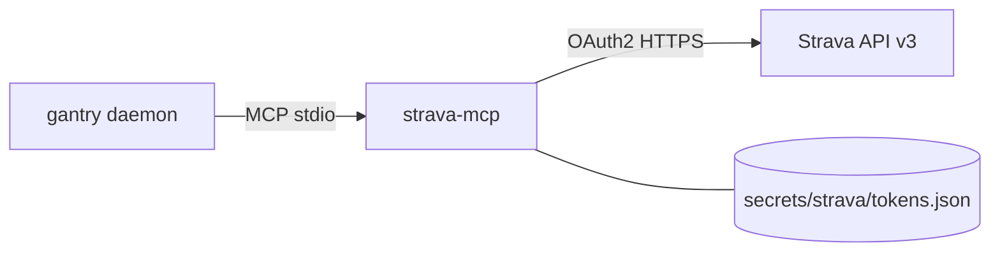

# Strava workout data (Garmin friendly)

Give LOCAL_AGENT your training history so he can nudge you ("bro, get to the gym"),
suggest rest, and summarize the week. This uses
[go-strava-mcp](https://github.com/shotah/go-strava-mcp) — our fork of
Stealinglight/StravaMCP with `{service}_{verb}_{object}` tool names (host:
`strava__activities_list`, not `strava__strava_*`). Single static Go binary;
gantry launches it over stdio.

**Using a Garmin?** Connect the watch to Strava once (Garmin Connect → Settings →
Connected Apps → Strava). Every activity then auto-syncs to Strava and LOCAL_AGENT reads
it here — no fragile unofficial Garmin login required.

Package: [go-strava-mcp](https://github.com/shotah/go-strava-mcp) ·
[Strava API](https://developers.strava.com).



---

## What LOCAL_AGENT can do

`strava-mcp` exposes 11 tools (host form `strava__…`). The useful ones here:

| Ask | Tool |
|---|---|
| "Summarize my workouts this week" | `strava__activities_list` + `strava__athlete_get_stats` |
| "Should I train or rest today?" | recent `strava__activities_list` (frequency / load heuristic) |
| "How was my last ride?" | `strava__activities_get`, `strava__activities_get_zones` |

> **Rest-day reality check:** true recovery metrics (HRV, Body Battery, sleep)
> are **Garmin-only**. Wire [docs/garmin.md](garmin.md) for those; with Strava
> alone, "rest today" is inferred from training frequency and load.

---

## 1. Create a Strava API app (once)

1. Go to <https://www.strava.com/settings/api>.
2. Fill in the app (any name/website). **Authorization Callback Domain** —
   one hostname only (lists like `localhost; shotah.github.io` fail). Use
   `shotah.github.io` for chat `/auth strava`. `localhost` stays whitelisted
   for laptop auth. Forks: your Pages host or `STRAVA_OAUTH_REDIRECT_URI` —
   see **[docs/auth.md](../../docs/auth.md)**. Chat paste is implemented;
   smoke-test before relying on it.
3. Copy the **Client ID** and **Client Secret** into `.env`:

```env
STRAVA_CLIENT_ID=12345
STRAVA_CLIENT_SECRET=xxxxxxxxxxxxxxxxxxxxxxxxxxxxxxxxxxxxxxxx
```

---

## 2. Authorize once (no local install)

**Headless / phone:** `/auth strava` in Telegram → open URL → paste
`/auth strava <code>`. Full guide: **[docs/auth.md](../../docs/auth.md)**.
(Needs callback domain `shotah.github.io` as above.)

**Laptop (localhost callback):** you **don't** need Go just for OAuth — the
`strava-mcp` binary is already in the image. Run `auth` in a throwaway
container that mounts `secrets/strava`.

```bash
make build          # once, if the appliance image is missing
make strava-auth    # prints a URL → approve in browser
# native (no Docker): gantry auth strava
```

Run this **on the machine with your browser**. Strava’s redirect is
`http://localhost:19876/callback` — it will not complete if you only SSH to a
headless host.

Equivalent Compose:

```bash
docker compose run --rm -p 127.0.0.1:19876:19876 \
  --entrypoint /usr/local/bin/gantry gantry auth strava
```

1. It prints `Open this URL in your browser: https://www.strava.com/oauth/authorize?...`
2. Open that URL, approve access.
3. Strava redirects to `http://localhost:19876/callback`; Compose forwards it
   into the container and you should see `Authenticated as <Your Name>!`.

That writes `data/.config/strava/tokens.json` (gitignored). When `DEPLOY_HOST`
is set, `make strava-auth` auto-pushes tokens to the server. The callback has a
2-minute timeout — have the browser ready.

Overview of all MCP browser logins:
[docs/deploy-docker.md § MCP tool auth](../../docs/deploy-docker.md#mcp-tool-auth-browser-oauth).

<details>
<summary>Alternative: run the binary directly (macOS / Linux / WSL)</summary>

Get the binary (`go install github.com/shotah/go-strava-mcp@latest`, or a
[release](https://github.com/shotah/go-strava-mcp/releases/latest)), then from
the repo root:

```bash
export STRAVA_CLIENT_ID=12345
export STRAVA_CLIENT_SECRET=xxxxxxxx
export STRAVA_TOKEN_PATH="$PWD/secrets/strava/tokens.json"

strava-mcp auth        # opens the browser; approve access
# -> "Authenticated as <Your Name>!"
```

On **Windows** use WSL: `localhost` is shared with Windows, so the browser
callback still lands. Point `STRAVA_TOKEN_PATH` at the repo's
`secrets/strava/tokens.json`.

</details>

---

## 3. Build + deploy

```bash
make build           # bakes strava-mcp into the image
make up              # local
# or: make remote-deploy   # image/manifest only — tokens are separate
make strava-sync           # push tokens.json when you mean to
```

`make remote-deploy` does **not** copy Strava tokens (avoids clobbering the
server). `make strava-auth` auto-runs **`make strava-sync`** when
`DEPLOY_HOST` is set.

---

## 4. Ask LOCAL_AGENT

Over Telegram:

- "Give me a summary of my workouts for the past week."
- "How many miles did I run this month?"
- "I trained hard the last three days — should I rest today?"

---

## Config (already wired)

`mcp.toml` lists the server — and with gantry, **listed = granted**. There are
no bundles, no deferred loading, and no approval prompts to configure:

```toml
[[server]]
name    = "strava"
command = "strava-mcp"
auth_args = ["auth"]
download_tag = "latest"
download_url = "https://github.com/shotah/go-strava-mcp/releases/download/{tag}/strava-mcp_{version}_{os}_{arch}.tar.gz"
```

Tools reach the model as `strava__{service}_{verb}_…` (e.g.
`strava__activities_list`). Eager-loaded at boot. If the binary can't start,
gantry fails loudly instead of letting the model improvise.

Credentials come from the container environment (set in `.env`, passed through
`docker-compose.yml`): `STRAVA_CLIENT_ID`, `STRAVA_CLIENT_SECRET`, and
`STRAVA_TOKEN_PATH=/data/.config/strava/tokens.json` (the mounted
`./secrets/strava`).

---

## Troubleshooting

| Symptom | Likely fix |
|---|---|
| LOCAL_AGENT doesn't see Strava tools | Check the `[[server]]` entry exists in `mcp.toml` and rebuild so `strava-mcp` is in the image — listed = granted, nothing else to wire |
| Boot fails with `mcp: boot server "strava"` | The binary is missing or crashing at start — rebuild the image (`make build` / `make remote-deploy`) and check `make logs` for the tool's stderr |
| Auth / 401 / token errors | `make strava-auth` (or `make strava-sync` after a local re-auth) |
| No activities | Confirm the watch/app actually syncs to Strava (Garmin → Connected Apps → Strava) |
| Rate limited | Strava caps ~100 req/15 min, 1000/day — ask for summaries, not per-second polling |
| No Windows binary | Use the container flow in [step 2](#2-authorize-once-no-local-install) — no local install; only the token file needs to reach the server |
