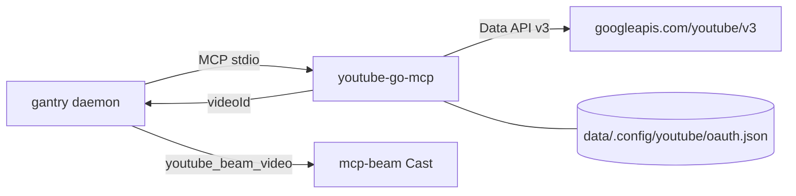

# YouTube (Data API v3)

Give LOCAL_AGENT YouTube search, playlists, and liked videos via
[youtube-go-mcp](https://github.com/shotah/youtube-go-mcp) **v1+** — a **static Go**
MCP over **YouTube Data API v3** (InnerTube / browser cookies are gone). Auth is
OAuth refresh tokens. gantry launches the binary over stdio.

Upstream: [shotah/youtube-go-mcp](https://github.com/shotah/youtube-go-mcp) ·
auth: [docs/auth.md](https://github.com/shotah/youtube-go-mcp/blob/main/docs/auth.md).



**Cast is separate.** This MCP returns cast-ready `videoId`s. Playback goes
through [docs/cast.md](cast.md) via `cast__youtube_beam_video` with the bare id —
do **not** invent royalty-free MP3 fallbacks, and do **not** pass watch URLs to
`cast__media_beam`.

Music is a **filter** (`musicOnly`, `musicLikely`) on Data API results — not a
second backend. YouTube Music Liked Songs / listen history are **not** in v3;
use thumbs-up likes + music-leaning search instead.

---

## What LOCAL_AGENT can do

Tools are prefixed `youtube__…` (server name `youtube` in `mcp.toml`):

| Ask | Tool | Auth |
|---|---|---|
| “Search YouTube for …” | `videos_search` (`musicOnly` → category 10) | required |
| “What’s this video?” | `videos_get` | required |
| “What’s on playlist X?” | `playlists_get` (`PL…` / `LL…`) | required |
| “What playlists do I have?” | `library_list_playlists` | required |
| “What have I liked?” | `library_list_liked_videos` | required |
| Cast payload + hint for a `videoId` | `cast_format_target` | no |

**Dropped (InnerTube-only):** `library_list_history`, `tracks_list_watch_playlist`,
`tracks_get_lyrics`, and all `tracks_*` names → use `videos_*`.

---

## 1. Optional `.env` pin

Defaults to GitHub `latest` each build. Pin only to freeze:

```env
# YOUTUBE_GO_MCP_VERSION=v1.0.0
```

Compose sets:

```text
YOUTUBE_OAUTH_PATH=/data/.config/youtube/oauth.json
YOUTUBE_OAUTH_CLIENT_ID=…          # from .env
YOUTUBE_OAUTH_CLIENT_SECRET=…      # from .env
```

Legacy `_*` names still work in the binary if preferred vars are empty.

---

## 2. Authorize

1. Google Cloud → enable **YouTube Data API v3** → OAuth client type
   **TVs and Limited Input devices**.
2. Put client id/secret in `.env` / `deploy/gantry.env`:
   `YOUTUBE_OAUTH_CLIENT_ID`, `YOUTUBE_OAUTH_CLIENT_SECRET`.
3. Mint a token:

```bash
make youtube-auth
```

Approve as the Google account that owns your YouTube likes/playlists (incognito
with only that account helps). GCP project owner email does **not** choose identity.

4. Confirm:

```bash
make youtube-whoami    # channel title/id
make youtube-probe     # --probe-data-api (likes / playlists)
```

If you still have `data/.config/ytmusic/oauth.json` from the Music era:

```bash
mkdir -p data/.config/youtube
mv data/.config/ytmusic/oauth.json data/.config/youtube/oauth.json
```

---

## 3. Deploy / restart

```bash
make build           # bakes youtube-go-mcp into the image
make up              # or make remote-deploy
make youtube-sync    # push oauth.json when you mean to (not part of remote-deploy)
```

`make remote-deploy` does **not** copy YouTube secrets. `make youtube-auth`
auto-runs **`make youtube-sync`** when `DEPLOY_HOST` is set.

---

## Config wiring

`mcp.toml` already has (listed = granted):

```toml
[[server]]
name    = "youtube"
command = "youtube-go-mcp"
auth_args = ["auth", "oauth", "--out", "${YOUTUBE_OAUTH_PATH}"]
```

---

## Smoke tests

```bash
make build
docker compose run --rm --entrypoint youtube-go-mcp gantry --version
make youtube-whoami
make youtube-probe
docker compose run --rm --entrypoint youtube-go-mcp gantry --self-test
```

Ask LOCAL_AGENT over Telegram:

- “Search YouTube for … and play it on the kitchen Nest”
- “List my YouTube playlists”
- “What have I liked lately?” (thumbs-up likes, not Music Liked Songs)

Flow: `youtube__videos_search` / library → pick `videoId` → (optional
`youtube__cast_format_target`) → Cast `cast__youtube_beam_video` with bare
`video_id` + room device.

---

## Troubleshooting

| Symptom | Likely fix |
|---|---|
| LOCAL_AGENT doesn’t see YouTube tools | `[[server]] name = "youtube"` in `mcp.toml`; rebuild for v1+ |
| Agent calls `youtube__tracks_*` | Persona stale — update `TOOLS.md` to `videos_*` |
| `youtube-go-mcp: not found` | `make build` / `make remote-deploy` |
| Empty likes, search works | No thumbs-up likes on that account, or wrong Google identity — `make youtube-whoami` |
| `invalid_client` | Client type must be **TVs and Limited Input devices** |
| Quota / 403 | Daily Data API quota — back off / reduce search |
| Nest connects but silence | Must use `cast__youtube_beam_video` + bare `videoId` |

---

## Follow-ups

- [x] Data API v3 cutover (youtube-go-mcp v1.0.0)
- [x] Tool rename `tracks_*` → `videos_*`; liked → `library_list_liked_videos`
- [x] Cast-by-video-ID via mcp-beam ([docs/cast.md](cast.md))
