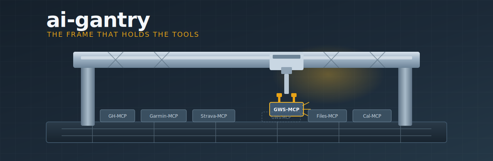
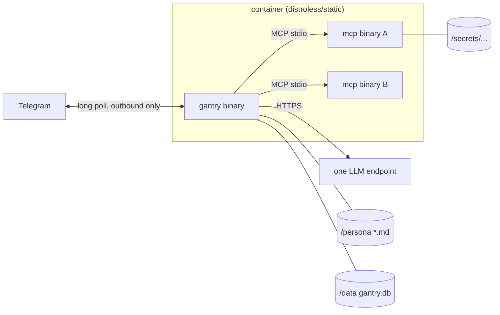

# ai-gantry 🏗️

<p align="center">
  
</p>

<p align="center">
  <a href="https://github.com/shotah/ai-gantry/actions/workflows/ci.yml"></a>
  <a href="https://github.com/shotah/ai-gantry/actions/workflows/ci.yml"></a>
</p>

> **gantry** *(n.)* — the rigid frame in a CNC machine or crane that holds and
> positions tools. The frame does nothing by itself; the tools do everything.

**ai-gantry** is a stupid-simple agent runtime: one static Go binary that runs
**one persona** with **one model** and whatever **MCP tool binaries** you mount
next to it. Built for distroless/static containers, configured entirely by env +
mounts. No dashboard, no config UI, no open ports — ever.

- 🧱 **MCP-first** — capabilities are external binaries over stdio; the frame
  hosts tools, it does not implement them
- 1️⃣ **1:1 by design** — one container = one persona + one model + one memory
  volume; want another brain, run another container
- ⚙️ **Env/compose is the config plane** — secrets via env, structure via two
  read-only mounts (persona markdown + MCP manifest); boot is fail-fast
- 🧠 **Inspectable memory** — typed SQLite rows you can read and delete with
  `sqlite3`, consolidated on a timer; no embeddings, no vector service
- ⚡ **Built for speed** — tiny Go binary, curated tool schemas, no embedding
  round-trips; Gemini 3 tool loops work (thought signatures preserved)
- 📴 **Outbound only** — Telegram long-polls out; healthcheck is an exit code,
  not an endpoint

> **Status: in production.** Tim runs on gantry (Gemini 3.5 Flash + Telegram +
> MCP). Templates: [examples/](examples/). Open follow-ups: [todo.md](todo.md).
> Build history: [docs/milestones.md](docs/milestones.md).

### Why it feels fast

Platform agent stacks pay a tax every turn: huge tool catalogs, embedding
memory, dashboards, pairing, shell shims. Gantry refuses that tax.

| Lever | What we do | Why it matters |
| --- | --- | --- |
| Tool surface | `mcp.toml` filters + MCP `--tool-tier core` (e.g. Garmin ~10, not ~100) | Smaller schemas → lower TTFT, better tool picks on Flash |
| Memory | SQLite + FTS5 in-process | No embedding API call before every reply |
| Runtime | One static Go binary on distroless/static | No Node/Bun/gateway process sitting in the path |
| Gemini 3 | Echo `thought_signature` on tool rounds (v0.0.3+) | Tool loops complete instead of 400’ing mid-turn |

Publish only the tools the persona needs. The frame stays out of the way; the
model and MCP binaries do the work.

## Quick start

Three ways to run — pick one.

### A) Local REPL (dev)

```bash
make init                 # deploy/persona + deploy/mcp.toml + .env.example
cp .env.example .env      # set LLM_API_KEY (and friends)
make run                  # CHANNEL=stdio by default
```

### B) Telegram bot (kernel image)

Tim-shaped compose under **[examples/personal-assistant/](examples/personal-assistant/)**:

```bash
make example-pa           # seed persona + .env
# edit examples/personal-assistant/.env
#   GEMINI_API_KEY=...
#   TELEGRAM_BOT_TOKEN=...
#   TELEGRAM_ALLOWED_USERS=123456789

docker compose -f examples/personal-assistant/compose.yml up -d --build
docker compose -f examples/personal-assistant/compose.yml logs -f
```

Kernel-only image: chat + memory + cron work immediately. MCP servers in
`mcp.toml` stay commented until you bake static tool binaries into an image
(or use path C).

### C) Full Tim (tools baked in)

Production personal assistant — Workspace, Strava, Garmin, Cast, YT Music,
search, remote deploy:

→ **[shotah/docker_open_claw](https://github.com/shotah/docker_open_claw)**  
(`make init && make build && make up`)

---

Operator cookbook: **[examples/README.md](examples/README.md)**. Deeper docs:
**[docs/](docs/)**. Open follow-ups: **[todo.md](todo.md)**.

## 1. Problem statement

Platform agent stacks drift toward multi-agent products: multiple providers,
dashboards, console features, config UI. Our deployment model is the opposite:

```text
container = persona + model + MCP set + memory volume
```

Want another LLM or persona? Spin up another container. No in-process routing,
no dashboard, no manual config surface — a kernel that does exactly that and
nothing else.

## 2. Design principles

1. **Stupid simple.** One agent, one model, one channel loop. If a feature
   needs a diagram to explain, it probably belongs in an MCP binary, not here.
2. **Highly performant.** Pure Go, static binary, no CGO, small RSS, no
   background frameworks. Long-poll + goroutines; nothing dials in.
3. **Highly portable.** `CGO_ENABLED=0`, ships on distroless/static (no shell).
   No glibc dependency in our binary, no writable rootfs beyond mounts.
4. **Plugin-centric.** Capabilities come from external binaries over MCP
   stdio. The gantry hosts tools; it does not implement them. Import libraries
   over writing our own (official MCP SDK, maintained Telegram lib, pure-Go
   SQLite).
5. **1:1, always.** No multi-provider config, no multi-agent config, no peer
   routing. Scaling = more containers via compose.
6. **Env/compose is the config plane.** Secrets and scalars via env. The only
   files are mounts: persona markdown, MCP server manifest, data volume.
7. **Memory is structured and inspectable.** SQLite rows you can read and
   delete with `sqlite3`, not opaque embedding blobs. Persona files always
   outrank recalled memory.

## 3. Non-goals

- Web dashboard, gateway, REST/WS API, pairing
- Multi-agent, multi-provider, model routing/fallback chains
- WhatsApp/SMS/Discord (channel interface exists; only Telegram + stdio ship)
- Built-in web search, built-in workspace tools (those are MCP binaries)
- Vector database service (see memory design — SQLite is the store)
- Sandboxing/risk-profile machinery (the container IS the sandbox; we run
  full-autonomy with a Telegram allowlist)

## 4. Architecture



### 4.1 Process model

One OS process. Goroutines:

| Goroutine | Job |
| --- | --- |
| channel poller | Telegram `getUpdates` long-poll, allowlist filter |
| agent loop | per-message: assemble prompt → model → tool calls → reply |
| MCP supervisors | one per server: spawn, health, restart w/ backoff |
| memory consolidator | optional timer job (see §7) |

No goroutine talks to the network inbound. Healthcheck is `gantry status`
(exit-code) reading a heartbeat row in SQLite — no port needed.

### 4.2 Package layout (single module)

```text
cmd/gantry/          main: run | status | version
internal/config/     env parsing + validation, fail-fast at boot
internal/channel/    Channel interface; telegram/, stdio/ (test/dev)
internal/provider/   ONE implementation: OpenAI-compatible chat client
internal/mcp/        stdio host: spawn, list tools, call, truncate, restart
internal/agent/      the loop: prompt assembly, tool iteration, caps
internal/session/    bounded history, /new reset, rolling summary
internal/memory/     SQLite structured memory + FTS5 + consolidation
internal/persona/    load + concat markdown from /persona
internal/heartbeat/  SQLite heartbeat for `gantry status`
internal/drain/      wait for in-flight turn on shutdown
internal/cron/       scheduled turns → agent → channel push
```
(Diagrams + sequences: [docs/architecture.md](docs/architecture.md).)

### 4.3 Dependencies (import over write)

| Concern | Library | Why |
| --- | --- | --- |
| MCP client | `github.com/modelcontextprotocol/go-sdk` | Official SDK; stdio transport, schema handling |
| SQLite | `modernc.org/sqlite` | Pure Go (no CGO), FTS5 works, one file DB |
| Telegram | `github.com/go-telegram/bot` | Zero-dep, maintained, long-poll native |
| LLM client | `github.com/openai/openai-go/v3` | Official; custom `base_url` covers Gemini's OpenAI-compat endpoint, xAI, Ollama, etc. |
| Env config | `github.com/caarlos0/env/v11` | Struct tags → env, tiny |
| MCP manifest | `github.com/pelletier/go-toml/v2` | Minimal TOML for `mcp.toml` |
| Logging | stdlib `log/slog` | JSON to **stderr** (keeps stdio REPL clean); `docker logs` still captures it |

One provider implementation (OpenAI-compatible) is deliberate: Gemini, Grok,
and local models all speak it. Model identity is just `LLM_BASE_URL` +
`LLM_MODEL` + `LLM_API_KEY`. No provider registry.

## 5. Configuration contract

Everything is env or a mount. No config UI, no `config set`, no sync step.

### 5.1 Environment variables

| Var | Required | Example / default |
| --- | --- | --- |
| `LLM_BASE_URL` | yes | `https://generativelanguage.googleapis.com/v1beta/openai` |
| `LLM_API_KEY` | yes | — |
| `LLM_MODEL` | yes | `gemini-3.5-flash` |
| `TELEGRAM_BOT_TOKEN` | yes (telegram) | — |
| `TELEGRAM_ALLOWED_USERS` | yes (telegram) | `123456789,987654321` (numeric IDs; **allowlist only — no pairing**) |
| `CHANNEL` | no | `telegram` (or `stdio` for dev) |
| `PERSONA_DIR` | no | `/persona` |
| `DATA_DIR` | no | `/data` |
| `MCP_MANIFEST` | no | `/etc/gantry/mcp.toml` |
| `HISTORY_MAX_MESSAGES` | no | `200` |
| `HISTORY_MAX_TOKENS` | no | `128000` |
| `TOOL_RESULT_MAX_CHARS` | no | `16000` |
| `TOOL_MAX_ITERATIONS` | no | `20` |
| `TOOL_SCHEMA_MAX_TOKENS` | no | `0` (log estimate only; `>0` = hard fail if over) |
| `MEMORY_ENABLED` | no | `true` |
| `MEMORY_BACKEND` | no | `builtin` (or `mcp:<server-name>`, see §7 / §10) |
| `MEMORY_CONSOLIDATE_MINUTES` | no | `30` (`0` = off; builtin backend only) |
| `CRON_ENABLED` | no | `true` |
| `CRON_TZ` | no | `UTC` (IANA, e.g. `America/Los_Angeles`) |
| `CRON_MAX_JOBS` | no | `50` |
| `CRON_TICK_SECONDS` | no | `15` |
| `STREAM_REPLIES` | no | `false` (Telegram edit-in-place / stdio token stream) |
| `LOG_LEVEL` | no | `info` |

Boot is fail-fast: missing required env = clear error + exit 1. No partial
starts, no interactive setup.

### 5.2 MCP manifest (the one file)

Lists of processes don't fit env vars; this is the single structured file,
mounted read-only. TOML, minimal:

```toml
[[server]]
name    = "google-workspace"
command = "google-workspace-mcp-go"
args    = ["--tools", "gmail drive calendar docs sheets tasks contacts", "--tool-tier", "core"]

[[server]]
name    = "garmin"
command = "garmin"
args    = ["mcp"]
tools   = ["get_sleep", "get_weight", "get_hrv"]  # optional allowlist
# exclude = ["raw_*"]                               # optional denylist
# tools_prefix = "garm"                             # optional; default name

[[server]]
name    = "strava"
command = "strava-mcp"
```

Listed servers still **start**; `tools` / `exclude` only filter what is
**published** to the model (boot logs `tools_listed` vs `tools_published`).
Schema cost is logged as `est_tokens` (chars/4); set `TOOL_SCHEMA_MAX_TOKENS`
to hard-fail when the published set is too fat.

No bundles/grants layer: if a server is in the manifest, the agent gets it.
The container composition IS the grant (1:1 model — you built this image/mount
for this persona on purpose).

Tool names are always prefixed `{server}__{tool}` (OpenAI-safe; avoids collisions).

### 5.3 Container contract

Sample layout matches `compose.yml` today; rename the service when you ship a
persona-specific image (e.g. `tim` / `gantry-tim:local`):

```yaml
services:
  gantry:
    image: gantry:local            # gantry (+ tool binaries in persona images)
    env_file: .env
    volumes:
      - ./deploy/persona:/persona:ro
      - ./deploy/mcp.toml:/etc/gantry/mcp.toml:ro
      - ./deploy/data:/data        # gantry.db (sessions + memory)
      - ./deploy/secrets:/secrets:ro
    healthcheck:
      # exec form + full path — distroless has no shell
      test: ["CMD", "/usr/local/bin/gantry", "status"]
```

Second persona/LLM = second service block. Nothing shared but the host.

## 6. The agent loop (context management)

This is the part that earns its keep. Keep it boring and bounded:

1. **Assemble prompt**: persona markdown (concat, fixed order) + memory
   hydration block (§7.4) + session history (bounded) + user message.
2. **Call model** with MCP tool schemas (loaded eagerly at boot; refreshed on
   server restart).
3. **Tool iteration**: execute calls via MCP host, truncate each result to
   `TOOL_RESULT_MAX_CHARS`, loop until final text or `TOOL_MAX_ITERATIONS`.
4. **Reply** on the channel; append turn to session.

Bounding rules:

- Hard cap `HISTORY_MAX_MESSAGES`; drop oldest turns past `HISTORY_MAX_TOKENS`.
  Token counts are chars/4 **estimates** and are labeled as such everywhere
  they surface (logs, `/status`) — see §10. Persona + last N turns are
  always protected.
- When history is trimmed, dropped turns fold into a persistent per-session
  `summary` paragraph via the same LLM (one string — not a framework). The
  summary is injected as a system block on later turns.
- Tool results older than the last 4 collapse to one line:
  `[tool gmail.search: N chars, truncated]`.
- `/new` wipes the session (memory untouched).

## 7. Memory design

Direction taken from Google's Always-On Memory Agent (2026): **no embeddings,
no vector DB — an LLM writes structured rows into SQLite and a background job
consolidates them.** At personal-agent scale, structured + FTS5 beats ANN
search and stays greppable/deletable. (Meta/OpenAI memory products converge on
the same shape: typed facts + episodic notes + periodic distillation.)

### 7.1 Store

One SQLite file `/data/gantry.db` (WAL mode), pure-Go driver:

```sql
CREATE TABLE memory (
  id          INTEGER PRIMARY KEY,
  kind        TEXT NOT NULL,       -- fact | preference | person | episode | insight
  subject     TEXT NOT NULL,       -- "chris", "climbing", "mom"
  content     TEXT NOT NULL,       -- one atomic statement
  source      TEXT NOT NULL,       -- chat | consolidation | operator
  confidence  REAL DEFAULT 1.0,
  created_at  TEXT NOT NULL,
  updated_at  TEXT NOT NULL,
  expires_at  TEXT,                -- TTL per kind (episodes decay, facts don't)
  superseded_by INTEGER            -- consolidation links, never silent delete
);
CREATE VIRTUAL TABLE memory_fts USING fts5(subject, content, content=memory);

CREATE TABLE session (...);        -- bounded history + rolling summary
CREATE TABLE heartbeat (...);      -- for `gantry status`
```

### 7.2 Write path

The model gets three built-in tools (the only non-MCP tools in the gantry):

- `memory_store(kind, subject, content)` — atomic statements only
- `memory_recall(query)` — FTS5 + recency-ranked
- `memory_forget(id | query)` — hard requirement; memory must be correctable

Auto-save is **off by default**. Auto-saved hallucinations (wrong emails) are
worse than no memory. The model stores deliberately; the consolidator promotes.

### 7.3 Consolidation (the Google idea)

A timer job (default 30 min, `0` disables) runs a cheap pass with the same LLM:

1. Read unconsolidated `episode` rows + recent session summaries.
2. Extract durable `fact`/`preference`/`person` rows; link duplicates via
   `superseded_by`; flag contradictions with persona files for the human
   instead of overwriting.
3. Write `insight` rows for cross-cutting patterns ("trains Tue/Thu, skips
   when traveling").

Cheap model, bounded batch, fully skippable. This is our "sleep cycle."

### 7.4 Read path (hydration)

At session start and on `memory_recall`, hydrate at most ~30 rows:
active facts/preferences (non-expired, non-superseded) + FTS5 hits for the
current message, rendered as a compact block:

```text
[memory]
- (person) mom: prefers calls over texts
- (preference) chris: coaching tone, no fluff
```

**Persona precedence is law**: anything in `/persona/USER.md` outranks memory;
contradictions get surfaced, not obeyed.

### 7.5 Why not vectors / cloud vector storage

- One user, one container: recall corpus is hundreds–thousands of rows, not
  millions. FTS5 + recency + kind filters is enough and is debuggable.
- Embeddings add a second model dependency, cache, and dimension migration
  for marginal recall gain at this scale.
- Cloud vector stores add network, cost, and privacy surface to the most
  sensitive data in the system.
- Escape hatch: schema reserves the option of an `embedding BLOB` column
  later. If recall quality ever demonstrably hurts, add it then — behind the
  same `memory_recall` interface, no design change.

## 8. Ops surface

- `gantry run` — the daemon (default)
- `gantry status` — exit-code healthcheck (reads `heartbeat` row in `/data/gantry.db`)
- `gantry version` — build info
- Logs: JSON `slog` to stderr; `docker logs` is the console.
- Telegram/stdio `/new` — session reset; `/status` — uptime/model/history/tools; `/tools` — prefixed catalog; unix `SIGHUP` reloads persona.
- Telegram photos: inbound → vision (Gemini/OpenAI-compat); outbound `SendPhoto` when the
  reply includes a markdown image or `*.png`/`*.jpg`/… URL (caption = remaining text).
- Dev: `make build|test|lint|run|ci|check`; `make install-hooks` for pre-commit
  (autofix + lint + test; same shape as go-garmin).

That's the entire ops/UI story. No port is opened by the gantry, ever.

## 9. Build & packaging

- Go ≥ 1.26, single module, `CGO_ENABLED=0`, `-trimpath -ldflags="-s -w"`.
- Targets: `linux/amd64`, `linux/arm64`.
- Image: multi-stage — build gantry (and later copy MCP tool binaries in),
  final `FROM gcr.io/distroless/static-debian12:nonroot` (ca-certs + tzdata,
  uid 65532, **no shell**). Healthchecks must use exec form
  (`["CMD","gantry","status"]`), never `CMD-SHELL`.
  MCP children must be static binaries too — there is no libc/shell to lean on.
- CI: `go vet`, `golangci-lint`, `go test ./internal/... ./cmd/...` with coverage; on `main`,
  the badge is pushed to `gh-pages` as `badges/coverage.svg` (README uses the `raw/gh-pages` URL).
- Release: `make release` (or `BUMP=minor|major` / `TAG=vX.Y.Z`) bumps
  `VERSION`, tags, and pushes; `.github/workflows/release.yml` runs GoReleaser
  on `v*` tags (same flow as the other shotah MCP repos).

## 10. Decisions

Locked choices are summarized here; full rationale and rejected alternatives
live in **[docs/choices.md](docs/choices.md)**.

1. **Name: ai-gantry 🏗️** — frame that holds tools; binary `gantry`.
2. **Token counting: estimates** (chars/4), labeled as estimates.
3. **Memory: builtin SQLite, replaceable** via `MEMORY_BACKEND=mcp:<name>`.
4. **Streaming replies: opt-in** (`STREAM_REPLIES=true`; Telegram edit-in-place).
5. **Telegram auth: allowlist only** — empty allowlist fails boot.
6. **Runtime image: distroless/static-debian12:nonroot** — MCP children static too.
7. **Logs on stderr** — stdout stays clean for the stdio REPL.

Architecture diagrams / sequences: [docs/architecture.md](docs/architecture.md).
Security tradeoffs & residual risks: [docs/security.md](docs/security.md).
Design deep-dive: [docs/design.md](docs/design.md).

## License

MIT — see [LICENSE](LICENSE).
