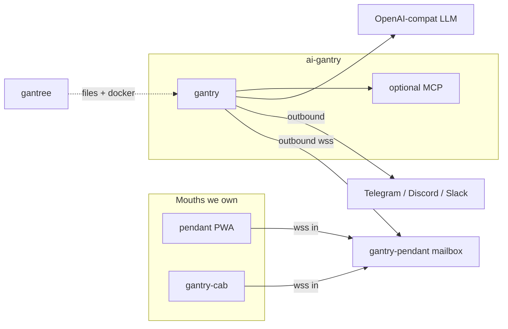

#  ai-gantry

<p align="center">
  
</p>

<!-- Hub uses docs/dockerhub.md + assets/banner.png (SVG/mermaid break on Docker Hub). -->

<p align="center">
  <a href="https://github.com/shotah/ai-gantry/actions/workflows/ci.yml"></a>
  <a href="https://github.com/shotah/ai-gantry/actions/workflows/docker.yml"></a>
  <a href="https://github.com/shotah/ai-gantry/actions/workflows/ci.yml"></a>
  <a href="https://hub.docker.com/r/shotah/ai-gantry"></a>
  <a href="https://hub.docker.com/r/shotah/ai-gantry"></a>
</p>

> **gantry** *(n.)* — the rigid frame that holds and positions tools. The
> frame does nothing by itself; the tools and the memory do the work.
> That frame is this binary: an **AI harness** around one model so an
> agent can **plan on a long horizon**.

**The product is the crane.** A Distroless Go process you run. One
persona. One OpenAI-compat model — Gemini, ChatGPT, Grok, or Ollama.
Chat dials *out*. Memory you can `sqlite3`. Aims that still exist on
Thursday. `/new` distills; it does not lobotomize.

```text
static binary + persona + any OpenAI-compat LLM  →  outbound chat
```

Nothing listens. There is no dashboard in the thing you talk to. Health
is an exit code, not a port. Chat, memory, cron, and web search work
with **zero extra tools** — MCP is a grant you add later.

The engineering budget went into the **loop**: parallel tool batches,
repairs so a small local model can finish a turn, context that does not
rot, personality that survives a reset. Console, metrics, and fleet
live one layer up in **[gantree](https://github.com/shotah/gantree)** —
the shipping yard — and never sit in a chat turn. Mouths we own are
**[gantry-pendant](https://github.com/shotah/gantry-pendant)** (phone)
and **[gantry-cab](https://github.com/shotah/gantry-cab)** (Android
Auto). Telegram stays the default.

If you need a team workspace on day one, this is the wrong repo — and
that's fine.

---

## The family

Four public repos. This one is the product. The others exist so you can
operate it and talk to it without anyone sitting in a token path.

<p align="center">
  
</p>

| Repo | Job | How it talks |
| --- | --- | --- |
| **This repo** | The crane. One process, one person, one model. | Dials out. Reads env + files. Never learns the yard exists. |
| **[gantree](https://github.com/shotah/gantree)** | Shipping yard. Board, grants, doctor, spend. | Writes `.env`, `mcp.toml`, persona, Docker. Pulls logs. Never in a chat turn. |
| **[gantry-pendant](https://github.com/shotah/gantry-pendant)** | Handheld + mailbox. Phone PWA + Cloudflare Durable Object. | Phone and crane both **dial in**. Zero inbound ports on the Mini. |
| **[gantry-cab](https://github.com/shotah/gantry-cab)** | The seat. Android Auto mouth. | Same mailbox, same crane. Not a second Worker. |

Telegram, Discord, and Slack are vendor mouths: the crane dials them
directly. Pendant and cab go through the mailbox we own. MCP binaries
are optional children on `PATH` — not a fifth product.

How the wires and the three doors line up:
**[docs/ecosystem.md](docs/ecosystem.md)**.


```mermaid
flowchart LR
  subgraph mouths["Mouths we own"]
    PWA["pendant PWA"]
    CAB["gantry-cab"]
  end
  TG["Telegram / Discord / Slack"]
  DO["gantry-pendant mailbox"]
  subgraph crane["ai-gantry"]
    K["gantry"]
    MCP["optional MCP"]
  end
  Y["gantree"]
  LLM["OpenAI-compat LLM"]
  PWA -->|"wss in"| DO
  CAB -->|"wss in"| DO
  K -->|"outbound wss"| DO
  K -->|"outbound"| TG
  Y -.->|"files + docker"| K
  K --> LLM
  K --> MCP
```

---

## Hello (Docker)

You need Docker, a chat mouth, and a model.

1. A [Gemini API key](https://aistudio.google.com/apikey) **or** any
   OpenAI-compatible endpoint (Ollama, xAI, …).
2. A Telegram bot token from [@BotFather](https://t.me/BotFather) and your
   numeric user id (e.g. [@userinfobot](https://t.me/userinfobot)).
   Discord and Slack work too — same compose file, different env.
   Pendant is `CHANNEL=pendant` after the Worker exists.

```bash
docker pull shotah/ai-gantry:latest
docker run --rm shotah/ai-gantry:latest version

git clone https://github.com/shotah/ai-gantry.git && cd ai-gantry
make example-docker
cd examples/docker
# set in .env:
#   GEMINI_API_KEY=...          # or LLM_BASE_URL + LLM_API_KEY + LLM_MODEL
#   TELEGRAM_BOT_TOKEN=...
#   TELEGRAM_ALLOWED_USERS=...  # numeric id, allowlist only
make up
make logs
```

Message the bot, then send `/status`. Walkthrough:
**[docs/deploy-docker.md](docs/deploy-docker.md)**.

Images: `shotah/ai-gantry:latest` (current `main`), `:edge` (`main`), `:0.x.y` (pin).
Same tags on `ghcr.io/shotah/ai-gantry`.

### Drop in a different model

The agent does not care which vendor you picked. Set these three and restart:

| You have | Set |
| --- | --- |
| Gemini key | `GEMINI_API_KEY` (the compose file maps it) |
| Another cloud API | `LLM_BASE_URL` + `LLM_API_KEY` + `LLM_MODEL` |
| Ollama on Linux | **[examples/native/](examples/native/)** · [deploy-native](docs/deploy-native.md) |

```bash
# examples/docker/.env — xAI, for instance
LLM_BASE_URL=https://generativelanguage.googleapis.com/v1beta/openai
LLM_API_KEY=...
LLM_MODEL=gemini-3.5-flash
```

### Other ways to run

| Path | When |
| --- | --- |
| **[examples/docker/](examples/docker/)** | Laptop / any Docker host *(start here)* |
| **[examples/native/](examples/native/)** | Linux + systemd + a local model |
| **[examples/hosting/gcp/](examples/hosting/gcp/)** · **[aws](examples/hosting/aws/)** | Small always-on VM |
| **[gantree](https://github.com/shotah/gantree)** | Console, metrics, grant tools, several agents |
| **[gantry-pendant](https://github.com/shotah/gantry-pendant)** | Phone chat we own (`CHANNEL=pendant`) |
| **[gantry-cab](https://github.com/shotah/gantry-cab)** | Android Auto, same mailbox |
| `make init && make run` | Hack on the binary (`CHANNEL=stdio`) |

Cookbook: **[examples/README.md](examples/README.md)**.
A full life-stack (persona + MCP + compose) lives in a consumer repo, not this harness.

---

## Chat is the console

Ops live in the same chat you already opened. No second UI in *this*
binary, no inbound port. Type `/help` anytime. Graphs, a board of
agents, MCP grants without SSH — that is
**[gantree](https://github.com/shotah/gantree)**. It never sits in a
chat turn.

| Command | What it does |
| --- | --- |
| `/status` `/perf` `/tokens` | Session bounds, trajectory (invocations / tools / batch), prompt size |
| `/tools` `/examples` `/engagement` `/spark` `/new` `/cancel` | Catalog, ideas, looking-after-you wakes, reset, abort |
| `/auth` | Headless MCP login — paste a code; no laptop callback |

Telegram is the default. Discord, Slack, and
**[pendant](https://github.com/shotah/gantry-pendant)** (our chat
client) are shipped (one `CHANNEL` per process). Cab is another mouth
on that same mailbox. Headless OAuth: **[docs/auth.md](docs/auth.md)**.

### Two files, not a catalog

Long-horizon means the person is still there tomorrow. Most agents *feel*
like someone after a long chat, then `/new` wipes them.

| File | Who writes it |
| --- | --- |
| `PERSONA.md` | You — who it should be, who you are, harness-builtin policy |
| `SELF.md` | The agent — voice, jokes, rituals, a few north-star aims that survive `/new` (you can delete any line) |

MCP tools are **not** listed in `PERSONA.md`. They come from the live catalog
(`/tools`, this turn's schemas, `[mcp prefixes]`). Keep `PERSONA.md` short
(2–4k characters, examples over rule dumps) or the middle of it gets ignored.
Progress logs and dated to-dos are memory / cron, not persona.

How to write one: **[docs/persona.md](docs/persona.md)**.
Horizon split: **[docs/persona.md](docs/persona.md#where-the-horizon-lives)**.
`SELF.md` drift: **[docs/troubleshooting.md](docs/troubleshooting.md#selfmd--personality-drift)**.

---

## Read next

| If you want… | Go here |
| --- | --- |
| How the four repos talk | **[docs/ecosystem.md](docs/ecosystem.md)** |
| What we actually built (honest inventory) | **[docs/features.md](docs/features.md)** |
| How to write `PERSONA.md` (tight, no MCP catalog, where the horizon lives) | **[docs/persona.md](docs/persona.md)** |
| How the harness is put together | **[docs/architecture.md](docs/architecture.md)** |
| Env, loop, memory, security | **[docs/design.md](docs/design.md)** |
| Wiring MCP tools | **[docs/mcp.md](docs/mcp.md)** |
| Discord / Slack / pendant | **[docs/channels.md](docs/channels.md)** |
| Console, metrics, or several agents | **[gantree](https://github.com/shotah/gantree)** |
| Chat from a phone we own | **[gantry-pendant](https://github.com/shotah/gantry-pendant)** |
| Chat from the car | **[gantry-cab](https://github.com/shotah/gantry-cab)** |

The harness is a small static Go binary. Tools are optional MCP processes.
We spent the budget on the loop so a **small local model** can finish a
tool turn instead of ERROR — that's the production story, not a requirement
to start. Long-horizon planning is the reason the loop, memory, cron, and
`SELF.md` exist.

## License

MIT — see [LICENSE](LICENSE).
