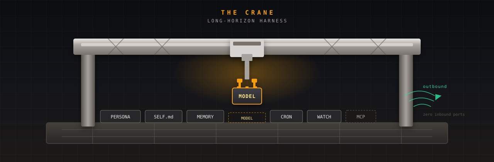
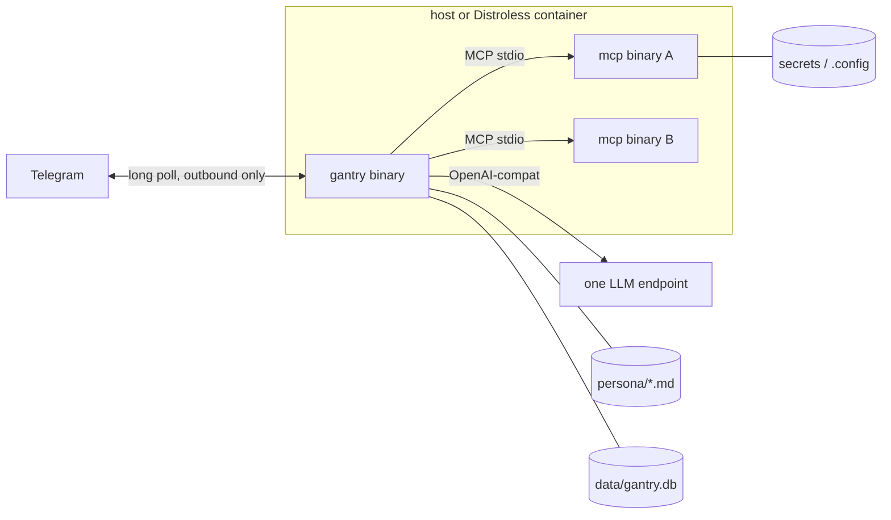

# ai-gantry 🏗️

<p align="center">
  
</p>

<p align="center">
  <a href="https://github.com/shotah/ai-gantry/actions/workflows/ci.yml"></a>
  <a href="https://github.com/shotah/ai-gantry/actions/workflows/docker.yml"></a>
  <a href="https://github.com/shotah/ai-gantry/actions/workflows/ci.yml"></a>
  <a href="https://hub.docker.com/r/shotah/ai-gantry"></a>
  <a href="https://hub.docker.com/r/shotah/ai-gantry"></a>
</p>

> **gantry** *(n.)* — the rigid frame in a CNC machine or crane that holds and
> positions tools. The frame does nothing by itself; the tools do everything.

**A personal agent you can actually own** — one static Go binary, one persona,
one model, MCP tools you choose, chat that only dials *out* (Telegram, Discord,
or Slack). No dashboard. No config UI. **No open ports. Ever.**

```text
static binary + persona + mcp.toml + any OpenAI-compat LLM  →  outbound chat
```

Chat, memory, and cron work with **zero MCP servers**. Tools are optional
binaries on `PATH` (or baked into an image) — the frame stays out of the way.

| | **Kernel** (`gantry`) | **Appliance** ([`local-agent/`](local-agent/)) |
| --- | --- | --- |
| What | Runtime only — env + mounts | Kernel + Workspace / Strava / Garmin / Cast / YT Music / search |
| Run it | Binary, systemd, or Distroless image | Native Linux + Ollama, or Docker compose |
| Start here if | You want a tiny host you control | You want a full life-stack assistant |

> **In production** as a native appliance (Telegram + local Qwen via Ollama +
> MCP). Same kernel also runs under Docker with Gemini/Grok. Not a demo
> scaffold — a binary with real deploy stories.

### Who this is for

You want a **self-hosted assistant** with a clear security story (outbound-only,
allowlist), **inspectable memory** (`sqlite3` on a file you own), and **MCP as
the only plugin surface** — not another multi-agent platform.

**Pick gantry** when you want small, boring, and shippable.  
**Pick something else** (OpenClaw-style stacks, LangGraph apps, SaaS agents)
when you need a web UI, team workspace, multi-agent routing, or pairing flows.
We deliberately don't build those.

| Status | Channel | Notes |
| --- | --- | --- |
| **Shipped** | Telegram (default) | Fastest hello path; long-poll |
| **Shipped** | Discord | DMs; Gateway WS — [docs/discord.md](docs/discord.md) |
| **Shipped** | Slack | Socket Mode only — [docs/slack.md](docs/slack.md) |
| **Planned** | Signal | Sidecar (`signal-cli`); not a Bot API — [todo.md](todo.md) |
| **Won’t** | WhatsApp / Teams / Messenger webhooks | Need inbound ports — breaks the model |

One `CHANNEL` per process. Allowlist only; no pairing.

### Why it stays sharp

Platform stacks tax every turn: huge tool catalogs, embedding round-trips,
gateways, dashboards. Gantry refuses that tax — and hardens the loop for
**local models** that invent tool names or park answers in CoT.

| Lever | What we do | Why it matters |
| --- | --- | --- |
| Tool surface | Manifest filters + MCP `--tool-tier` | Smaller schemas → better tool picks (Flash *or* Qwen) |
| Name repair | Prefix alias/rebuild, closest-name hints, then a grammar-constrained retry | `google_search__…` and `mcp__get_hrv` still land; an unresolvable name makes the retry unable to misspell it |
| Think stalls | Promote CoT → reply after tools | Multi-step turns finish instead of ERROR |
| Printed calls | Parse a tool call written as text and run it | A model that prints `{"name":…}` never speaks JSON at you |
| Multi-bubble | Interrupt + coalesce + settle (`COALESCE_SETTLE_MS`) | “Strava… wait Garmin… nvm calendar” → one joined turn |
| Slow turns | Per-turn perf logs + tool trace in the chat bubble | Know whether prefill, thinking, or an MCP is the wait |
| Memory | SQLite + FTS5 in-process | No embedding API before every reply |
| Runtime | One static binary (systemd *or* Distroless) | No Node/Bun/gateway in the path |
| Gemini 3 | Preserves `thought_signature` on tool rounds | Cloud multi-step turns don't 400 |

Details: [docs/mcp.md](docs/mcp.md) · [docs/deploy-native.md](docs/deploy-native.md).

---

## Start here

| Path | When | Doc |
| --- | --- | --- |
| **Native + local model** *(featured)* | Linux mini-PC, Ollama/Qwen, systemd | **[docs/deploy-native.md](docs/deploy-native.md)** → [`local-agent/deploy/`](local-agent/deploy/) |
| **Docker + cloud LLM** | Hub/compose, Gemini hello in minutes | **[docs/deploy-docker.md](docs/deploy-docker.md)** → [`examples/personal-assistant/`](examples/personal-assistant/) |
| **REPL** | Hack on the binary | `make init && make run` (`CHANNEL=stdio`) |

Full life-stack (tools + auth helpers): **[local-agent/](local-agent/)**.  
Cookbook: **[examples/README.md](examples/README.md)**. Design / security /
MCP: **[docs/](docs/)**. Follow-ups: **[todo.md](todo.md)**.

---

## Reference

Deep contract below — principles, env table, memory, packaging. Skim if you
already have a bot running; read before you grant MCP tools or expose an
allowlist to friends.

## 1. Problem statement

Platform agent stacks drift toward multi-agent products: multiple providers,
dashboards, console features, config UI. Our deployment model is the opposite:

```text
process = persona + model + MCP set + data dir
```

Want another LLM or persona? Another process (second systemd unit or compose
service). No in-process routing, no dashboard, no manual config surface — a
kernel that does exactly that and nothing else.

## 2. Design principles

1. **Stupid simple.** One agent, one model, one channel loop. If a feature
   needs a diagram to explain, it probably belongs in an MCP binary, not here.
2. **Highly performant.** Pure Go, static binary, no CGO, small RSS, no
   background frameworks. Long-poll + goroutines; nothing dials in.
3. **Highly portable.** `CGO_ENABLED=0` static binary — runs under systemd or
   Distroless (no shell in the image). No glibc dependency in our binary.
4. **Plugin-centric.** Capabilities come from external binaries over MCP
   stdio. The gantry hosts tools; it does not implement them. Import libraries
   over writing our own (official MCP SDK, maintained Telegram lib, pure-Go
   SQLite).
5. **1:1, always.** No multi-provider config, no multi-agent config, no peer
   routing. Scaling = more processes (compose services or systemd units).
6. **Env + files is the config plane.** Secrets and scalars via env. Structure
   via persona markdown, MCP manifest, and a data directory (bind-mounts in
   Docker; paths on the host for native).
7. **Memory is structured and inspectable.** SQLite rows you can read and
   delete with `sqlite3`, not opaque embedding blobs. Persona files always
   outrank recalled memory.

## 3. Non-goals

- Web dashboard, gateway, REST/WS API, pairing
- Multi-agent, multi-provider, model routing/fallback chains
- Multi-channel in one process; inbound-port chat (WhatsApp Cloud, Teams,
  Messenger webhooks) — see channel table under [Who this is for](#who-this-is-for)
- Built-in web search, built-in workspace tools (those are MCP binaries)
- Vector database service (see memory design — SQLite is the store)
- Sandboxing/risk-profile machinery (the host or Distroless container is the
  sandbox; we run full-autonomy with an allowlist)

## 4. Architecture


```mermaid
flowchart LR
  TG[Telegram] <-->|long poll, outbound only| K

  subgraph Host["host or Distroless container"]
    K[gantry binary]
    M1[mcp binary A]
    M2[mcp binary B]
    K -->|MCP stdio| M1
    K -->|MCP stdio| M2
  end

  K -->|OpenAI-compat| LLM[one LLM endpoint]
  K --- P[("persona/*.md")]
  K --- D[("data/gantry.db")]
  M1 --- S[("secrets / .config")]
```

Deploy shapes: [native](docs/deploy-native.md) · [Docker](docs/deploy-docker.md).

### 4.1 Process model

One OS process. Goroutines:

| Goroutine | Job |
| --- | --- |
| channel poller | Telegram `getUpdates` long-poll, allowlist filter |
| agent loop | per-message: assemble prompt → model → tool calls → reply |
| MCP supervisors | one per server: spawn, health, restart w/ backoff |
| memory consolidator | optional timer job (see §7) |

No goroutine talks to the network inbound. Healthcheck is `gantry status`
(exit-code) reading a heartbeat row in SQLite — no port needed.

### 4.2 Package layout (single module)

```text
cmd/gantry/          main: run | init | auth | status | version
internal/config/     env parsing + validation, fail-fast at boot
internal/channel/    Channel interface; telegram/, stdio/ (test/dev)
internal/provider/   ONE implementation: OpenAI-compatible chat client
internal/mcp/        stdio host: spawn, list tools, call, truncate, restart
internal/agent/      the loop: prompt assembly, tool iteration, caps
internal/session/    bounded history, /new reset, rolling summary
internal/memory/     SQLite structured memory + FTS5 + consolidation
internal/persona/    load + concat markdown from /persona
internal/heartbeat/  SQLite heartbeat for `gantry status`
internal/drain/      wait for in-flight turn on shutdown
internal/cron/       scheduled turns → agent → channel push
```
(Diagrams + sequences: [docs/architecture.md](docs/architecture.md).)

### 4.3 Dependencies (import over write)

| Concern | Library | Why |
| --- | --- | --- |
| MCP client | `github.com/modelcontextprotocol/go-sdk` | Official SDK; stdio transport, schema handling |
| SQLite | `modernc.org/sqlite` | Pure Go (no CGO), FTS5 works, one file DB |
| Telegram | `github.com/go-telegram/bot` | Zero-dep, maintained, long-poll native |
| LLM client | `github.com/openai/openai-go/v3` | Official; custom `base_url` covers Gemini's OpenAI-compat endpoint, xAI, Ollama, etc. |
| Env config | `github.com/caarlos0/env/v11` | Struct tags → env, tiny |
| MCP manifest | `github.com/pelletier/go-toml/v2` | Minimal TOML for `mcp.toml` |
| Logging | stdlib `log/slog` | JSON to **stderr** (keeps stdio REPL clean; journald / `docker logs`) |

One provider implementation (OpenAI-compatible) is deliberate: Gemini, Grok,
and local models all speak it. Model identity is just `LLM_BASE_URL` +
`LLM_MODEL` + `LLM_API_KEY`. No provider registry.

## 5. Configuration contract

Everything is env or a mount. No config UI, no `config set`, no sync step.

### 5.1 Environment variables

| Var | Required | Example / default |
| --- | --- | --- |
| `LLM_BASE_URL` | yes | `https://generativelanguage.googleapis.com/v1beta/openai` |
| `LLM_API_KEY` | yes | — |
| `LLM_MODEL` | yes | `gemini-3.5-flash` |
| `LLM_MAX_TOKENS` | no | `4096` (completion output cap; `0` = provider default) |
| `TELEGRAM_BOT_TOKEN` | yes (telegram) | — |
| `TELEGRAM_ALLOWED_USERS` | yes (telegram) | `123456789,987654321` (numeric IDs; **allowlist only — no pairing**) |
| `TELEGRAM_ERROR_REPORTING` | no | `off` (`off`\|`error`\|`warn` — tee slog into the Tim chat as expandable HTML) |
| `DISCORD_BOT_TOKEN` | yes (discord) | — |
| `DISCORD_ALLOWED_USERS` | yes (discord) | snowflake user IDs; **allowlist only** — see [docs/discord.md](docs/discord.md) |
| `SLACK_BOT_TOKEN` | yes (slack) | `xoxb-…` bot token |
| `SLACK_APP_TOKEN` | yes (slack) | `xapp-…` app-level token (`connections:write`) — [docs/slack.md](docs/slack.md) |
| `SLACK_ALLOWED_USERS` | yes (slack) | Slack member IDs; **allowlist only** |
| `CHANNEL` | no | `telegram` (default), `discord`, `slack`, or `stdio` |
| `PERSONA_DIR` | no | `/persona` |
| `DATA_DIR` | no | `/data` |
| `MCP_MANIFEST` | no | `/etc/gantry/mcp.toml` |
| `HISTORY_MAX_MESSAGES` | no | `200` |
| `HISTORY_MAX_TOKENS` | no | `128000` |
| `TOOL_RESULT_MAX_CHARS` | no | `16000` |
| `TOOL_MAX_ITERATIONS` | no | `20` |
| `TOOL_SCHEMA_MAX_TOKENS` | no | `0` (log estimate only; `>0` = hard fail if over) |
| `MEMORY_ENABLED` | no | `true` |
| `MEMORY_BACKEND` | no | `builtin` (or `mcp:<server-name>`, see §7 / §10) |
| `MEMORY_CONSOLIDATE_MINUTES` | no | `30` (`0` = off; builtin backend only) |
| `CRON_ENABLED` | no | `true` |
| `CRON_TZ` | no | `UTC` (IANA, e.g. `America/Los_Angeles`) |
| `CRON_MAX_JOBS` | no | `50` |
| `CRON_TICK_SECONDS` | no | `15` |
| `STREAM_REPLIES` | no | `true` (Telegram edit-in-place / stdio token stream) |
| `SHOW_THINKING` | no | `true` (Telegram CoT italics → expandable blockquote; needs `STREAM_REPLIES`; independent of `LLM_REASONING_EFFORT`) |
| `TOOL_TRACE` | no | `compact` (`compact` = `Making Calls: ✓, ✗`; `full` = → name / ✓ timing; `off` = hide; needs `STREAM_REPLIES`) |
| `COALESCE_SETTLE_MS` | no | `2000` (quiet ms after a bubble **interrupts a running turn**, before one joined turn; a lone message never waits; `0` = off) |
| `SPINUP_NOTICE_MS` | no | `4000` (post “working on it” after this much model silence; the first turn after start posts at once; needs `STREAM_REPLIES`; `0` = off) |
| `LOG_LEVEL` | no | `info` |

Boot is fail-fast: missing required env = clear error + exit 1. No partial
starts, no interactive setup.

### 5.2 MCP manifest (the one file)

Lists of processes don't fit env vars; this is the single structured file,
mounted read-only. TOML, minimal:

```toml
[[server]]
name    = "google"
command = "google-mcp"
args    = ["--preset", "everyday"]
auth_args = ["auth"]
download_tag = "latest"   # or pin "v1.0.0"; "latest" resolves via GitHub API at plan time
download_url = "https://github.com/shotah/google-mcp/releases/download/{tag}/google-mcp_{version}_{os}_{arch}.tar.gz"

[[server]]
name    = "garmin"
command = "garmin"
args    = ["mcp"]
auth_args = ["login"]     # optional; `gantry auth garmin`
tools   = ["get_sleep", "get_weight", "get_hrv"]  # optional allowlist
# exclude = ["raw_*"]                               # optional denylist
# tools_prefix = "garm"                             # optional; default name
download_tag = "latest"
download_url = "https://github.com/shotah/go-garmin/releases/download/{tag}/garmin_{version}_{os}_{arch}.tar.gz"

[[server]]
name    = "strava"
command = "strava-mcp"
auth_args = ["auth"]
download_tag = "latest"
download_url = "https://github.com/shotah/go-strava-mcp/releases/download/{tag}/strava-mcp_{version}_{os}_{arch}.tar.gz"
```

`download_url` + `download_tag` are for native deploy (`gantry tools-plan` /
`make remote-native-fetch`): placeholders `{os}` `{arch}` `{tag}` `{version}`
(`version` = tag without leading `v`). Omit them when binaries are already on
`PATH` (e.g. Docker bake). Optional `auth_command` / `auth_args` drive
`gantry auth <name>`.

Listed servers still **start**; `tools` / `exclude` only filter what is
**published** to the model (boot logs `tools_listed` vs `tools_published`).
Schema cost is logged as `est_tokens` (chars/4); set `TOOL_SCHEMA_MAX_TOKENS`
to hard-fail when the published set is too fat.

No bundles/grants layer: if a server is in the manifest, the agent gets it.
The process composition IS the grant (1:1 — you chose this persona + MCP set
on purpose).

Tool names are always prefixed `{server}__{tool}` (OpenAI-safe; avoids
collisions). Local models often turn the hyphenated *prefix* into underscores
(`google_search__google_search`), or invent one outright (`mcp__get_hrv`); the
host repairs both back to the catalog name when exactly one tool can be meant,
and on hard misses returns a model-facing suggestion naming the closest real
tools. Full contract, `/tools` REPL workflow, and why:
**[docs/mcp.md](docs/mcp.md)**.

### 5.3 Host layout

Same three directories whether Docker bind-mounts them or systemd points at
`/opt/gantry/…`:

| Role | Typical path |
| --- | --- |
| Persona markdown | `PERSONA_DIR` → `/persona` or `/opt/gantry/persona` |
| MCP manifest | `MCP_MANIFEST` → `/etc/gantry/mcp.toml` or `/opt/gantry/mcp.toml` |
| SQLite + secrets | `DATA_DIR` → `/data` or `/opt/gantry/data` |

Compose sample + Hub hello: [docs/deploy-docker.md](docs/deploy-docker.md).  
systemd + Ollama: [docs/deploy-native.md](docs/deploy-native.md).

## 6. The agent loop (context management)

This is the part that earns its keep. Keep it boring and bounded:

1. **Assemble prompt**: persona markdown (concat, fixed order) + memory
   hydration block (§7.4) + session history (bounded) + user message.
2. **Call model** with MCP tool schemas (loaded eagerly at boot; refreshed on
   server restart).
3. **Tool iteration**: execute calls via MCP host (repair unambiguous prefix
   mistakes, else suggest closest real names *and* constrain the next call to
   them with a response-format grammar), truncate each result to
   `TOOL_RESULT_MAX_CHARS`, loop until final text or `TOOL_MAX_ITERATIONS`.
   Each call appends a trace line (`→ name`, `✓ 1.2s · 4.1k chars`) to a
   streaming reply so long chains show motion.
4. **Reply** on the channel; append turn to session.

Every turn logs its own cost: `model call` (`first_token_ms`, `dur_ms`,
`prompt_est_tokens`, `tool_schemas`), `tool done` (`dur_ms`, `result_chars`),
and `turn perf` (`model_ms` / `tool_ms` / `total_ms`). On local models that
split is the difference between a prefill problem and a slow MCP —
[docs/deploy-native.md](docs/deploy-native.md#latency-measure-before-tuning).

Bounding rules:

- Hard cap `HISTORY_MAX_MESSAGES`; drop oldest turns past `HISTORY_MAX_TOKENS`.
  Token counts are chars/4 **estimates** and are labeled as such everywhere
  they surface (logs, `/status`) — see §10. Persona + last N turns are
  always protected.
- When history is trimmed, dropped turns fold into a persistent per-session
  `summary` paragraph via the same LLM (one string — not a framework). The
  summary is injected as a system block on later turns.
- Tool results older than the last 4 collapse to one line:
  `[tool gmail.search: N chars, truncated]`.
- `/new` wipes the session (memory untouched).

## 7. Memory design

Direction taken from Google's Always-On Memory Agent (2026): **no embeddings,
no vector DB — an LLM writes structured rows into SQLite and a background job
consolidates them.** At personal-agent scale, structured + FTS5 beats ANN
search and stays greppable/deletable. (Meta/OpenAI memory products converge on
the same shape: typed facts + episodic notes + periodic distillation.)

### 7.1 Store

One SQLite file `$DATA_DIR/gantry.db` (WAL mode), pure-Go driver:

```sql
CREATE TABLE memory (
  id          INTEGER PRIMARY KEY,
  kind        TEXT NOT NULL,       -- fact | preference | person | episode | insight
  subject     TEXT NOT NULL,       -- "chris", "climbing", "mom"
  content     TEXT NOT NULL,       -- one atomic statement
  source      TEXT NOT NULL,       -- chat | consolidation | operator
  confidence  REAL DEFAULT 1.0,
  created_at  TEXT NOT NULL,
  updated_at  TEXT NOT NULL,
  expires_at  TEXT,                -- TTL per kind (episodes decay, facts don't)
  superseded_by INTEGER            -- consolidation links, never silent delete
);
CREATE VIRTUAL TABLE memory_fts USING fts5(subject, content, content=memory);

CREATE TABLE session (...);        -- bounded history + rolling summary
CREATE TABLE heartbeat (...);      -- for `gantry status`
```

### 7.2 Write path

The model gets three built-in tools (the only non-MCP tools in the gantry):

- `memory_store(kind, subject, content)` — atomic statements only
- `memory_recall(query)` — FTS5 + recency-ranked
- `memory_forget(id | query)` — hard requirement; memory must be correctable

Auto-save is **off by default**. Auto-saved hallucinations (wrong emails) are
worse than no memory. The model stores deliberately; the consolidator promotes.

### 7.3 Consolidation (the Google idea)

A timer job (default 30 min, `0` disables) runs a cheap pass with the same LLM:

1. Read unconsolidated `episode` rows + recent session summaries.
2. Extract durable `fact`/`preference`/`person` rows; link duplicates via
   `superseded_by`; flag contradictions with persona files for the human
   instead of overwriting.
3. Write `insight` rows for cross-cutting patterns ("trains Tue/Thu, skips
   when traveling").

Cheap model, bounded batch, fully skippable. This is our "sleep cycle."

### 7.4 Read path (hydration)

At session start and on `memory_recall`, hydrate at most ~30 rows:
active facts/preferences (non-expired, non-superseded) + FTS5 hits for the
current message, rendered as a compact block:

```text
[memory]
- (person) mom: prefers calls over texts
- (preference) user: coaching tone, no fluff
```

**Persona precedence is law**: anything in `USER.md` outranks memory;
contradictions get surfaced, not obeyed.

### 7.5 Why not vectors / cloud vector storage

- One user, one process: recall corpus is hundreds–thousands of rows, not
  millions. FTS5 + recency + kind filters is enough and is debuggable.
- Embeddings add a second model dependency, cache, and dimension migration
  for marginal recall gain at this scale.
- Cloud vector stores add network, cost, and privacy surface to the most
  sensitive data in the system.
- Escape hatch: schema reserves the option of an `embedding BLOB` column
  later. If recall quality ever demonstrably hurts, add it then — behind the
  same `memory_recall` interface, no design change.

## 8. Ops surface

- `gantry run` — the daemon (default)
- `gantry status` — exit-code healthcheck (reads `heartbeat` row in `$DATA_DIR/gantry.db`)
- `gantry version` — build info
- Logs: JSON `slog` to stderr (`journalctl` native, `docker logs` in compose).
- Telegram/stdio slash commands: `/new` (session reset), `/cancel` (halt in-flight turn), `/status`, `/tools`; unix `SIGHUP` reloads persona.
- **Multi-bubble (interrupt → coalesce → settle):** a lone message runs at once;
  a follow-up sent while a turn is running cancels the current loop, joins the
  bubbles into one user message, waits `COALESCE_SETTLE_MS` (default **2000**)
  of quiet, then resubmits as a single turn. `/cancel` also clears a pending
  settle batch. Tools that already finished are not undone. Cron/reaction
  synthetics skip this path. Details:
  [local-agent/docs/telegram.md](local-agent/docs/telegram.md).
- **Spin-up notice:** local models prefill in silence, so `SPINUP_NOTICE_MS`
  (default **4000**) opens the streaming bubble with a status line before the
  first token — at once on the first turn after start (known-cold: model load
  and/or empty prompt cache), otherwise only if the turn stays silent that long
  (a prompt-cache miss, which no provider API exposes). The line is transient —
  the reply replaces it, unlike a tool trace. Needs `STREAM_REPLIES`.
- Telegram photos: inbound → vision (Gemini/OpenAI-compat); outbound `SendPhoto` when the
  reply includes a markdown image or `*.png`/`*.jpg`/… URL (caption = remaining text).
- Dev: `make build|test|lint|run|ci|check`; `make install-hooks` for pre-commit
  (autofix + lint + test; same shape as go-garmin).

That's the entire ops/UI story. No port is opened by the gantry, ever.

## 9. Build & packaging

- Go ≥ 1.26, single module, `CGO_ENABLED=0`, `-trimpath -ldflags="-s -w"`.
- Targets: `linux/amd64`, `linux/arm64`.
- Image: multi-stage — build gantry (and later copy MCP tool binaries in),
  final `FROM gcr.io/distroless/static-debian12:nonroot` (ca-certs + tzdata,
  uid 65532, **no shell**). Healthchecks must use exec form
  (`["CMD","gantry","status"]`), never `CMD-SHELL`.
  MCP children must be static binaries too — there is no libc/shell to lean on.
- CI: `go vet`, `golangci-lint`, `go test ./internal/... ./cmd/...` with coverage; on `main`,
  the badge is pushed to `gh-pages` as `badges/coverage.svg` (README uses the `raw/gh-pages` URL).
- Release: `make release` (or `BUMP=minor|major` / `TAG=vX.Y.Z`) bumps
  `VERSION`, tags, and pushes; `.github/workflows/release.yml` runs GoReleaser
  on `v*` tags (same flow as the other shotah MCP repos).

## 10. Decisions

Locked choices are summarized here; full rationale and rejected alternatives
live in **[docs/choices.md](docs/choices.md)**.

1. **Name: ai-gantry 🏗️** — frame that holds tools; binary `gantry`.
2. **Token counting: estimates** (chars/4), labeled as estimates.
3. **Memory: builtin SQLite, replaceable** via `MEMORY_BACKEND=mcp:<name>`.
4. **Streaming replies: on by default** (`STREAM_REPLIES=true`; edit-in-place where the channel supports it; set `false` for a single final bubble).
5. **Channel auth: allowlist only** — empty allowlist fails boot (Telegram / Discord / Slack).
6. **Runtime image: distroless/static-debian12:nonroot** — MCP children static too.
7. **Logs on stderr** — stdout stays clean for the stdio REPL.

Architecture diagrams / sequences: [docs/architecture.md](docs/architecture.md).
Security tradeoffs & residual risks: [docs/security.md](docs/security.md).
Design deep-dive: [docs/design.md](docs/design.md).

## License

MIT — see [LICENSE](LICENSE).
